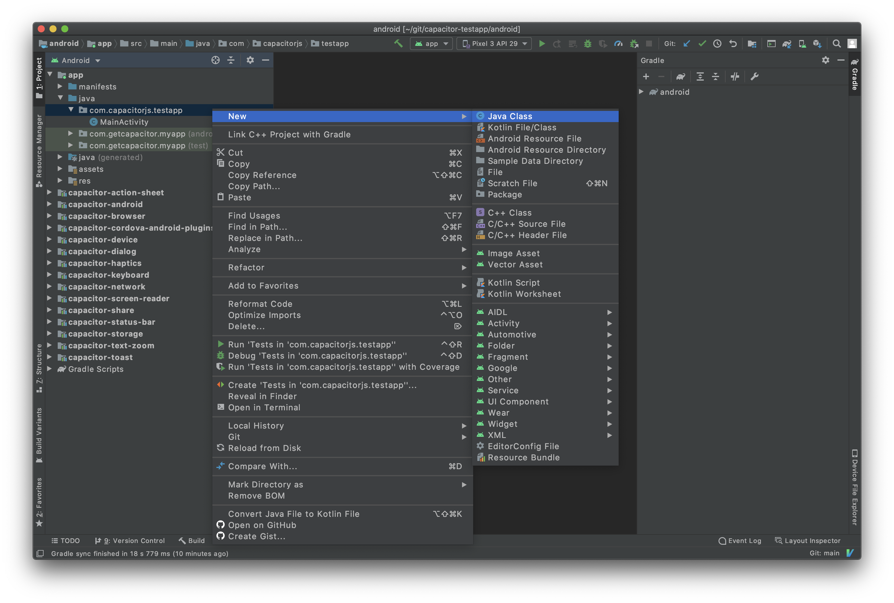

# カスタム Native Android コード

Capacitorでは、アプリが必要とするネイティブ機能を実装するためにJavaやKotlinのコードを書くことが推奨されています。

[Capacitorプラグイン](/plugins.md) が全てに対応するわけではないかもしれませんが、それはそれで構いません! アプリの中でWebViewにアクセスできるネイティブコードを書くことは可能です。

## WebView から Native コードにアクセス

JavaScriptとネイティブコード間の通信を行う最も簡単な方法は、アプリにローカルなカスタムCapacitorプラグインを構築することです。

### `EchoPlugin.java`

まず、EchoPlugin.java`ファイルを作成します。Android Studioを開き(/main/android/index.md#opening-the-android-project)、**app**モジュールと**java**フォルダを展開、アプリのJavaパッケージを右クリックして、コンテキストメニューから **New** -> **Java Class** を選択して、ファイルを作成してください。



以下のJavaコードを`EchoPlugin.java`にコピーします:

```java
package com.example.myapp;

import com.getcapacitor.JSObject;
import com.getcapacitor.Plugin;
import com.getcapacitor.PluginCall;
import com.getcapacitor.PluginMethod;
import com.getcapacitor.annotation.CapacitorPlugin;

@CapacitorPlugin(name = "Echo")
public class EchoPlugin extends Plugin {

    @PluginMethod()
    public void echo(PluginCall call) {
        String value = call.getString("value");

        JSObject ret = new JSObject();
        ret.put("value", value);
        call.resolve(ret);
    }
}
```

### プラグインを登録する

CapacitorがJavaとJavaScriptの橋渡しをするために、AndroidとWebの両方でカスタムプラグインを登録する必要があります。

#### `MainActivity.java` の登録

アプリの `MainActivity.java` で、 `registerPlugin()` または `registerPlugins()` を使用して、カスタムプラグインを登録します。

```diff
 public class MainActivity extends BridgeActivity {
     @Override
     public void onCreate(Bundle savedInstanceState) {
+        registerPlugin(EchoPlugin.class);
         super.onCreate(savedInstanceState);
     }
 }
```

#### JavaScript

JSでは、`@capacitor/core`の `registerPlugin()` を使って、Javaプラグインにリンクされたオブジェクトを作成します。

```typescript
import { registerPlugin } from '@capacitor/core';

const Echo = registerPlugin('Echo');

export default Echo;
```

> これは `EchoPlugin.java` にある `@CapacitorPlugin` アノテーションの `name` 属性と一致する必要があります。

**TypeScript**

インターフェースを定義して、それを `registerPlugin()` のコールで使用することで、リンク先のオブジェクトの型を定義することができます。

```diff
 import { registerPlugin } from '@capacitor/core';

+export interface EchoPlugin {
+  echo(options: { value: string }): Promise<{ value: string }>;
+}

-const Echo = registerPlugin('Echo');
+const Echo = registerPlugin<EchoPlugin>('Echo');

 export default Echo;
```

`registerPlugin()` の generic パラメータは、リンク先のオブジェクトの構造を定義するものです。必要なら `registerPlugin<any>('Echo')` を使って型を無視することができます。判定はしません。❤️

### プラグインを使う

エクスポートされた `Echo` オブジェクトを使用して、プラグインのメソッドを呼び出します。以下のスニペットは、Android 上の Java に呼び出され、結果を表示します。

```typescript
import Echo from '../path/to/echo-plugin';

const { value } = await Echo.echo({ value: 'Hello World!' });
console.log('Response from native:', value);
```

### 次のステップ

[Androidプラグインガイドを読む &#8250;](/plugins/creating-plugins/android-guide.md)
