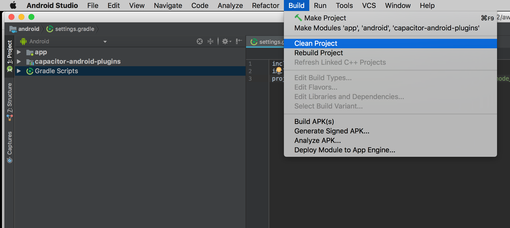
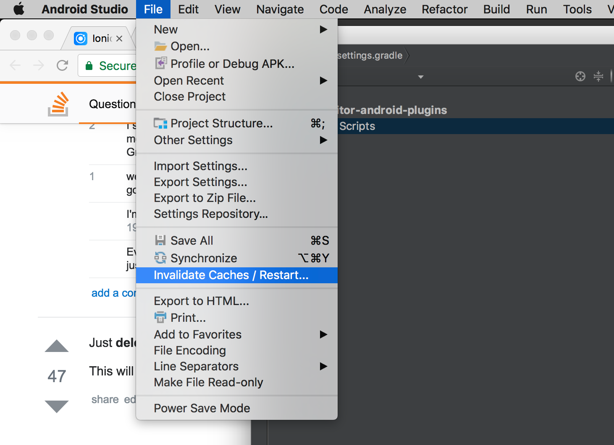
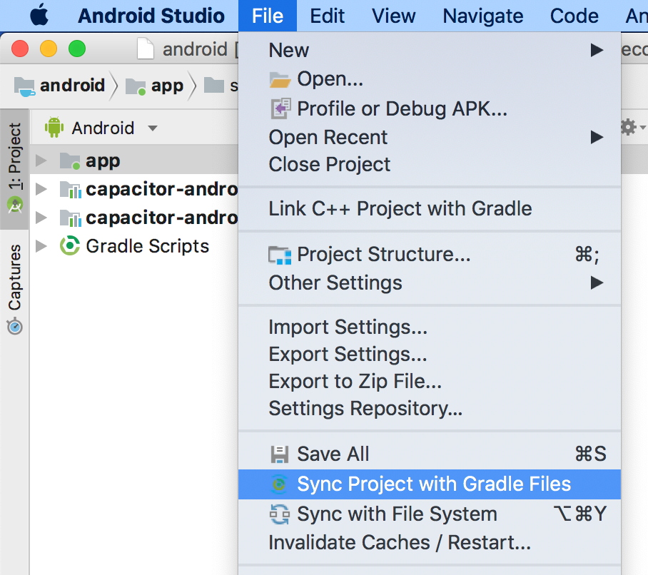
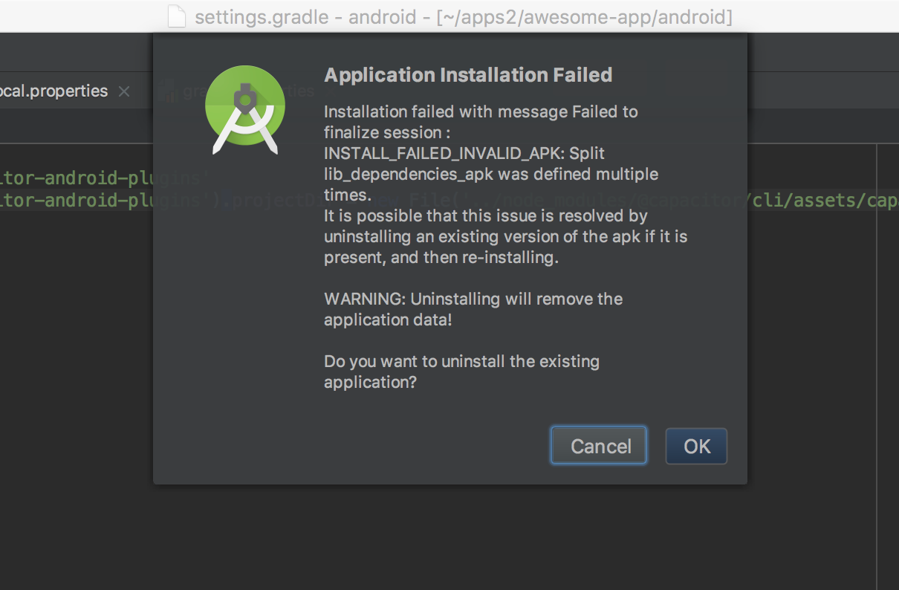
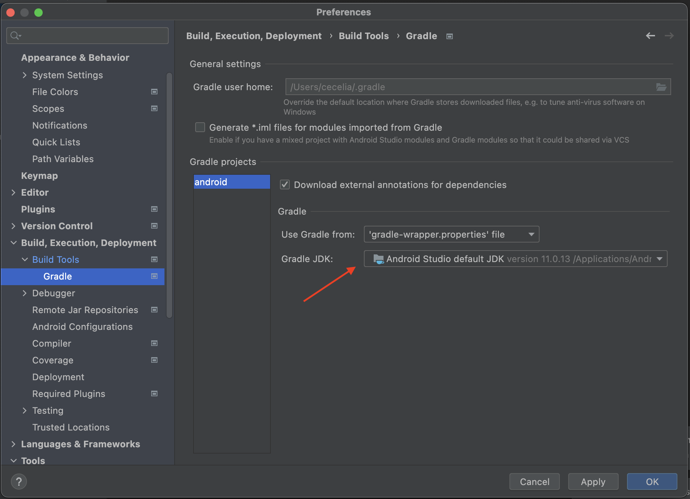

# Android の問題のトラブルシューティング

100％完璧な Native 管理ツールを作成するのはほぼ不可能です。遅かれ早かれ、Android ワークフローの一部でさまざまな問題に遭遇するでしょう。

このガイドでは、考えられる解決策とともに一般的な Android の問題を文書化することを試みます。

## Android Toolbox

Android 開発者は、Android の問題をデバッグするためのいくつかの一般的なテクニックを学びます。

### Google, Google, Google

Android、Gradle、エミュレータなどで問題が発生した場合、最初にすべきことは、そのエラーをコピーして Google 検索にペーストすることです。

Capacitor は標準的な Android ツールキットを使用していますので、何か問題が発生した場合、多くの Android 開発者も同様に問題を抱えており、解決策が存在する可能性があります。

依存関係の更新、Gradle sync の実行、キャッシュの無効化などの簡単な方法があります。

## Gradle Sync

npm から新しいプラグインをインストールしたのに、Android のビルドでプラグインが使えない、または表示されない場合は、Android Studio の右上にある「Sync Project with Gradle Files」ボタン（アイコンは象の形をしています）を使ってみてください。これにより、Android のネイティブコードが新しいプラグインのコードを含むように再同期され、新しいプラグインを使用できるようになります。詳細については、 [this issue on Github](https://github.com/ionic-team/capacitor/issues/4012) をご覧ください。

他にも様々な問題に対応できるので、Android のビルドで問題が発生した際には、"Sync Project with Gradle Files "を実行することをお勧めします。

### クリーン/リビルド

クリーンとリビルドを行うことで、多くのビルド問題を解決することができます。



### キャッシュの無効化/再起動

問題を解決した自信があっても、Android Studio や Gradle が納得しない場合、多くの場合、Android Studio のキャッシュを無効にしてプログラムを再起動することで解決します。

これは File メニューから簡単に行うことができます:



## Error: "package android.support.\* does not exist"

このエラーは、Cordova や Capacitor のプラグインが、新しい AndroidX に相当するものではなく、古い android support の依存関係を使用している場合に発生します。
この問題をプラグインのリポジトリに報告することで、メンテナが AndroidX の依存性を使用するようプラグインを更新することができます。

回避策として、jetifier を使ってプラグインにパッチを当てることもできます。

```bash
npm install jetifier
npx jetify
npx cap sync android
```

## Error: "Please select Android SDK"

このエラーは、多くの場合、Gradle の同期が必要なことが原因です。
これは、依存関係を更新したり、プロジェクトの設定を変更した後に定期的に行う必要があります。

Gradle を手動で同期するには、メインメニューバーから「File」→「Sync Project with Gradle Files」を開きます:



## Error: "APK Can't be installed"

APK がエミュレータやデバイスにインストールできないのは、同じパッケージ名の既存のアプリがあることが原因の場合が多いです。アプリを実行しようとすると、次のようなエラーが表示されることがあります:



解決策としては、古いアプリを削除し、パッケージ名が `AndroidManifest.xml` で最新のものになっていて、開発中の他のアプリと競合していないことを確認します。

最後に、念のため、クリーンアップとリビルドを行います。

## Error: "Unable to locate a Java Runtime"

このエラーは、環境変数 `JAVA_HOME` が設定されていない場合に `run` コマンドを使用すると発生する可能性があります。

解決するには、Android StudioのPreferences > Build, Execution, Deployment, Build Tools > Gradle > Gradle JDKにあるパスを用いて、環境変数またはシステム変数として `JAVA_HOME` を設定します。



Macの場合は、`.zshrc` または `.bashrc` ファイルで更新するか、環境にエクスポートします。

```bash
export JAVA_HOME="/Applications/Android Studio.app/Contents/jbr/Contents/Home"
```

Windowsの場合、環境変数の設定で、`JAVA_HOME` をシステム変数として設定することができます。

## プロジェクトの再構築

Capacitor では、自分の Android プロジェクトを管理することができます。IDE で管理されているプロジェクトと同様に、時には同期が取れなくなることもあり、その場合はプロジェクトを再構築するしかありません。

これを行うには、以下の手順に従います。

1. 作成したソースコード（`app/android/src`にある Java ファイル、マニフェストファイル、リソースファイルなど）を`app/android`以外の安全な場所にコピーします。
2. 続いて、Capacitor CLI を最新のバージョンにアップデートします: `npm install @capacitor/cli@latest`
3. android ディレクトリを削除します：`rm -rf android/`。
4. Capacitor からアンドロイドアプリを再作成します：`npx cap add android`。
5. 保存したソースファイルをプロジェクトにコピーして戻す

## プラグインが実装されていない

Androidでは、Capacitorがプラグインを見つけられない場合やWebViewにコードを注入できない場合にこのエラーが発生する可能性があります。

まず、プラグインがインストールされており、`package.json`に表示されていることを確認してください。

次に、`npx cap sync android`を実行します。

最後に、Android Studioの右上にある「Sync Project with Gradle Files」ボタン（象のようなアイコン）を使用します。これにより、ネイティブAndroidコードが新しいプラグインコードを含むように再同期され、新しいプラグインを使用できるようになります。

また、Capacitor 1または2から移行する場合は、[自動プラグイン読み込み](https://capacitorjs.com/docs/updating/3-0#switch-to-automatic-android-plugin-loading)を有効にしていることを確認してください。

それでも「Plugin not implemented」エラーが発生する場合は、Service Workerを使用していないことを確認してください。Service WorkerはCapacitorとプラグインのコードの注入を妨げます。Service Workerを使用したい場合は、[この回避策](https://github.com/ionic-team/capacitor/issues/1655#issuecomment-579229390)を使用して注入を機能させることができます。

## ProGuardの使用

ProGuardは、アプリを縮小、難読化、およびサイズ削減するために使用されるツールです。`build.gradle`の`minifyEnabled`オプションを`true`に設定することで有効になります。このプロセスは、コードリフレクションなど実行時にコードが読み取り可能であることに依存するプラグインやカスタムネイティブコードを使用する場合、Capacitorで問題を引き起こすことがあります。ProGuardはコードをスキャンしてアプリのサイズを最適化・縮小しようとしますが、このプロセスでプラグインの機能に重要なクラスやメソッドが削除されることがあります。

Capacitor v3.2.3以降、Capacitorプラグイン、パーミッション、およびアクティビティ結果のコア機能をカバーするProGuardルールがCapacitorに含まれています。v3.2.3より前のバージョンのCapacitorを使用している場合は、[以下のルール](https://github.com/ionic-team/capacitor/blob/main/android/capacitor/proguard-rules.pro)をAndroidプロジェクトの`proguard-rules.pro`ファイルに追加してください。これらのルールは、Capacitorのコア機能とコアプラグインの問題を解決するはずです。

それらのルールを追加しても問題が発生する場合は、ソースプラグインまたはネイティブコードを特定し、特定のプラグインコードをカバーするルールを追加してみてください。例：

```
-keep class com.mythirdpartyplugin.** { *; }
```

CapacitorプラグインがProGuardの問題を引き起こしていることが確実で、すべてのプラグインをProGuard処理から除外しても構わない場合は、以下のProGuardルールですべてのプラグインクラスコードをカバーできます：

```
-keep public class * extends com.getcapacitor.Plugin
```
