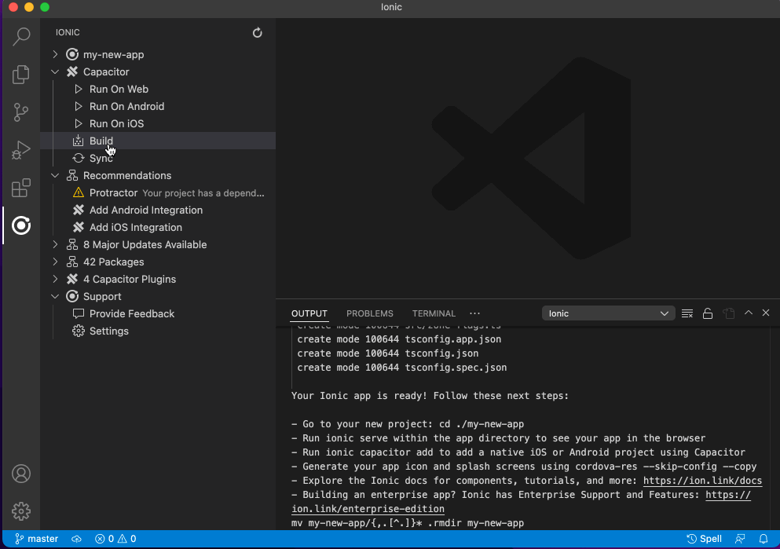
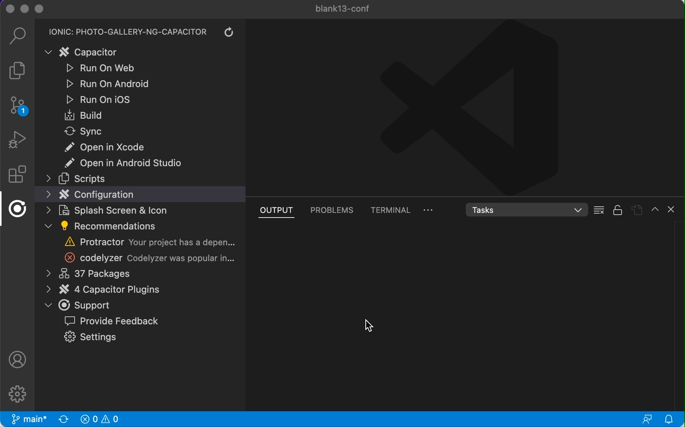
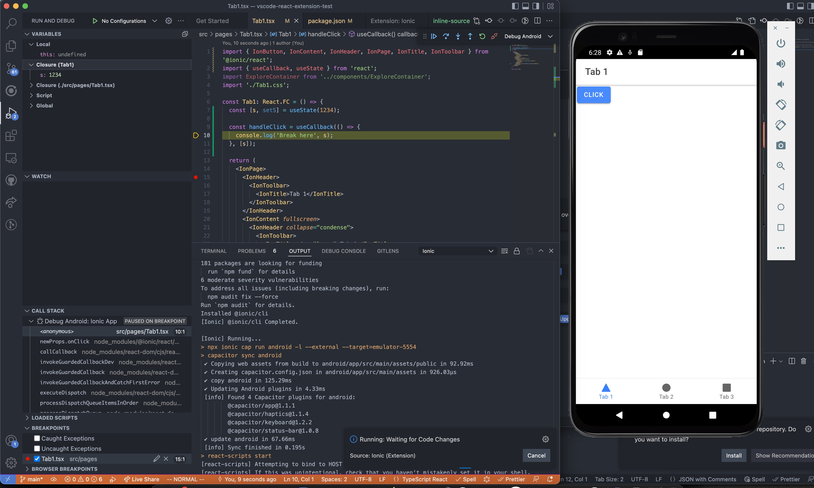

## Ionic/CapacitorのVS Code Extensionを使う

Ionic Visual Studio Code拡張は、Capacitorの公式拡張を兼ねており、Capacitorアプリの開発に共通する様々な機能を、VS Codeのウィンドウを離れることなく実行できるようにします。Visual Studio Marketplace上の拡張機能](https://marketplace.visualstudio.com/items?itemName=ionic.ionic)をインストールすることができます。拡張機能をインストールすると、アクティビティバーにIonicのロゴが表示されるようになります。

## Capacitorの統合

既存のアプリケーションに [Capacitor](https://capacitorjs.com/) を追加するには、「Integrate Capacitor」を選択します。

Capacitorが統合されたことで、「Run On Web」「Run On Android」「Run On iOS」オプションで、Web、Android、iOSでアプリを実行できるようになりました。

## Cordova からの移行

[CordovaからCapacitorへの移行](https://capacitorjs.com/docs/cordova/migrating-from-cordova-to-capacitor) を行う場合、Ionic VS Code拡張を使用すると、そのプロセスをスピードアップすることができます。

このエクステンションは

- Capacitorの依存関係をプロジェクトに追加します。
- 既知の、互換性のないCordovaパッケージのフラグを立てる。
- 必要でない Cordova プラグインを削除します。
- 特定のCordovaプラグインを同等のCapacitorプラグインに置き換えます。
- などなど。

この拡張機能は、CordovaからCapacitorへの移行を以前より簡単に行うためのガイドに従うことを支援します。

## ネイティブプロジェクト設定の構成

Ionic VS Code 拡張は、プロジェクトに関連する Android と iOS の変数を簡単に設定するのにも役立ちます。

アプリケーションの表示名、バージョン番号、ビルド番号、およびその他の設定値をプロジェクト内で簡単に変更することができます。

## デバッグ

Ionicエクステンションを使用すると、Web、Android、iOS（近日公開予定）でVS Codeデバッガーを実行できます。

Debug フォルダ下のオプションを使用すると、Web とネイティブの両方のコードにブレークポイントを設定することができます。Web用のデバッグは、デバッグ可能な別のWebブラウザインスタンスを起動します（デフォルトではGoogle Chrome）。また、設定オプションからMicrosoft Edgeを選択することもできます。Android では、Webview インスタンスは "Debug" フォルダーにリストされ、Web と同様にデバッグ可能です。

## もっとやること

Ionic VS Code 拡張は、マイグレーション、デバッグ、モノレポサポートなど、役立つことがたくさんあります。拡張機能の全リストは、[extension overview on the VS Code Marketplace](https://marketplace.visualstudio.com/items?itemName=ionic.ionic) をご覧ください。
