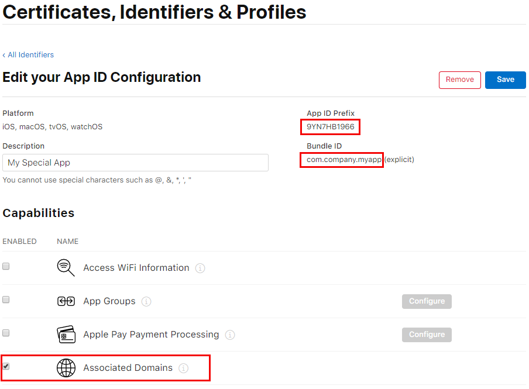
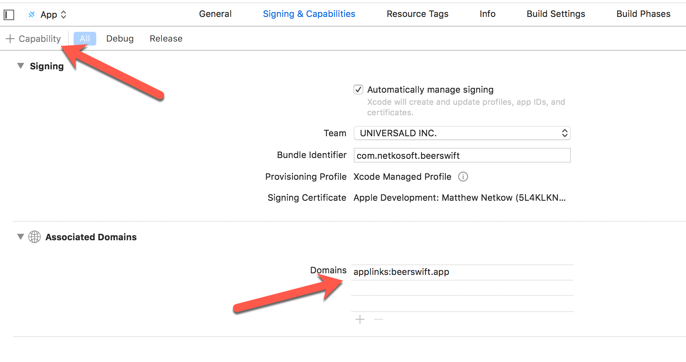
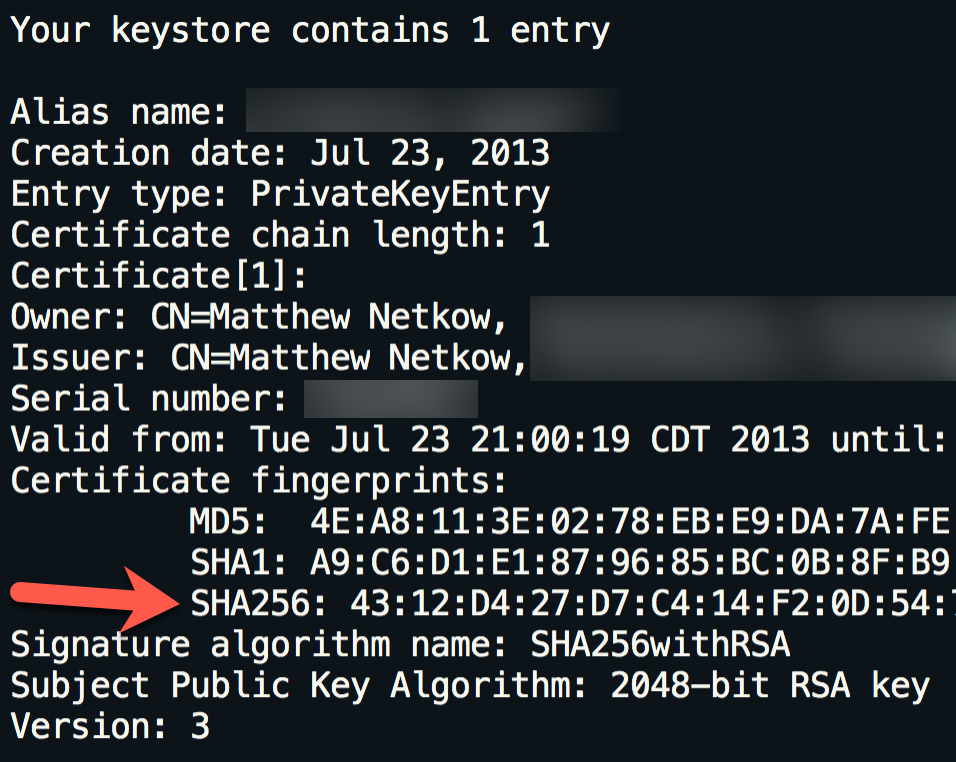
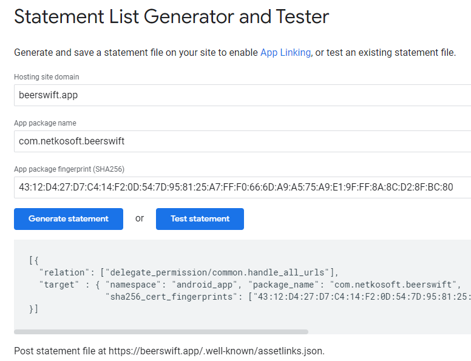

# ユニバーサルリンクとアプリリンクによるディープリンク

**プラットフォーム**: iOS, Android

ユニバーサルリンク（iOS）とアプリリンク（Android）は、ユーザーをネイティブアプリ内の特定のコンテンツに直接誘導する機能を提供します（一般的にはディープリンクとして知られています）。

ユーザーがディープリンクをタップまたはクリックすると、デバイスの Web ブラウザや Web サイトを経由せずに、ユーザーは直接アプリに移動します。アプリがインストールされていない場合は、ユーザーはウェブサイトに誘導されます。ユーザーが Web サイトに直接移動した場合、ユーザーは Web サイトに留まります。このように、ディープリンクは、ウェブ、iOS、Android 向けに構築されたクロスプラットフォームのアプリにとって、優れた機能となっています。

メリット

- 安全。ユニバーサル/アプリリンクでは、HTTPS URL を使用してお客様が所有するウェブサイトのドメインにリンクするため、他のアプリがお客様のリンクを使用できないことが保証されます。
- シームレスな体験。1 つの URL がウェブサイトとアプリの両方で機能するため、ユーザーはエラーなく目的のコンテンツに正常にアクセスできます。
- エンゲージメントの向上。リンクは、メールクライアントや検索エンジンの検索結果などから開くことができます。

## デモビデオ

ここでは、実際にどのように見えるかを説明します。この例では、ユーザーはネイティブアプリをインストールしています。メールに記載されたアプリのリンクをタップすると、アプリ自体に直接アクセスできます。まず、ルートリンクをタップすると（https://beerswift.app）、アプリのメインページに移動します。次に、ディープリンクをタップすると（https://beerswift.app/tabs/tab3）、Tab3のページが表示されます。

<iframe width="560" height="315" src="https://www.youtube.com/embed/vadlZ-d8wAI" frameborder="0" allow="accelerometer; autoplay; encrypted-media; gyroscope; picture-in-picture" allowfullscreen></iframe>

## 前提条件

- 設定済みの [Capacitor app](/docs/getting-started) があること。
- iOS の場合、Apple Developer Program に登録していること。

例示のため、ウェブアプリのリンクとして https://beerswift.app を使用します。

## Capacitor App API によるディープリンクルーティング

ディープリンクがクリックされた後にネイティブアプリが開かれた場合、モバイル OS は自動的にユーザーをどこに誘導すればよいかを知りません。これは、アプリの起動時に Capacitor [App API](/docs/apis/app) を使用して、アプリ自体に実装する必要があります。

Web サイトとアプリのパスが一致しない場合は、より高度な URL パターンマッチングを実装する必要があります（例は [本ガイド](https://devdactic.com/universal-links-ionic/) を参照）。モバイルアプリとウェブアプリが同じコードベースを使用している場合は、同じ URL にリダイレクトするだけなので、非常に簡単です。以下の例はこれを前提としています。

### Angular

Routing should be implemented in `app.component.ts`. Start by importing `NgZone` and `Router` from Angular, then `App` from Capacitor:

```typescript
import { Component, NgZone } from '@angular/core';
import { Router } from '@angular/router';
import { App, URLOpenListenerEvent } from '@capacitor/app';
```

Next, add `Router` and `NgZone` to the constructor:

```typescript
constructor(private router: Router, private zone: NgZone) {
    this.initializeApp();
}
```

Last, listen for the `appUrlOpen` event, and redirect when a deep link is found:

```typescript
initializeApp() {
    App.addListener('appUrlOpen', (event: URLOpenListenerEvent) => {
        this.zone.run(() => {
            // Example url: https://beerswift.app/tabs/tab2
            // slug = /tabs/tab2
            const slug = event.url.split(".app").pop();
            if (slug) {
                this.router.navigateByUrl(slug);
            }
            // If no match, do nothing - let regular routing
            // logic take over
        });
    });
}
```

### React

There's a variety of options for React. One approach is to wrap the App API listener functionality in a new component, then add it inside of `App.tsx`. Start by creating `AppUrlListener.tsx` then import the React Router `useHistory` hook as well as the Capacitor App API:

```typescript
import React, { useEffect } from 'react';
import { useHistory } from 'react-router-dom';
import { App, URLOpenListenerEvent } from '@capacitor/app';
```

Next, define the AppUrlListener component, listening for the `appUrlOpen` event then redirecting when a deep link is found:

```typescript
const AppUrlListener: React.FC<any> = () => {
  let history = useHistory();
  useEffect(() => {
    App.addListener('appUrlOpen', (event: URLOpenListenerEvent) => {
      // Example url: https://beerswift.app/tabs/tab2
      // slug = /tabs/tab2
      const slug = event.url.split('.app').pop();
      if (slug) {
        history.push(slug);
      }
      // If no match, do nothing - let regular routing
      // logic take over
    });
  }, []);

  return null;
};

export default AppUrlListener;
```

Over in `App.tsx`, import the new component:

```typescript
import AppUrlListener from './pages/AppUrlListener';
```

Then add it inside of `IonReactRouter` (or wherever your app is bootstrapped, just ensure that the History hook is available):

```tsx
const App: React.FC = () => {
  return (
    <IonApp>
      <IonReactRouter>
        <AppUrlListener></AppUrlListener>
        <IonRouterOutlet>
          <Route path="/home" component={Home} exact={true} />
          <Route exact path="/" render={() => <Redirect to="/home" />} />
        </IonRouterOutlet>
      </IonReactRouter>
    </IonApp>
  );
};
```

### Vue

VueJS offers a first party routing system that integrates natively with Vue called Vue Router. To set up deep linking with Vue Router, start in the file that you used to configure all of your routes (usually `routes.js` or something similar).

First we import the capacitor `App` from plugins along with `Vue` and `VueRouter`.

```typescript
import { App, URLOpenListenerEvent } from '@capacitor/app';
import Vue from 'vue';
import VueRouter from 'vue-router';
```

Next, configure your routes using the Vue Router (more information on [Getting Started with Vue Router](https://router.vuejs.org/guide/#javascript)).

```typescript
const router = new VueRouter({
  routes: [],
});
```

It's recommended to use `mode: history` so you don't have to deal with the `#`.

Let Vue know that you are using Vue Router and register the router within Vue:

```typescript
const VueApp = new Vue({
  router,
}).$mount('#app');
```

Finally, we need to register our app for deep linking. To do that, we add an event listener to the `appUrlOpen` event on the Capacitor App. Capacitor will pick this up, then we hand it off to Vue Router to navigate to the page requested.

```typescript
App.addListener('appUrlOpen', function (event: URLOpenListenerEvent) {
  // Example url: https://beerswift.app/tabs/tabs2
  // slug = /tabs/tabs2
  const slug = event.url.split('.app').pop();

  // We only push to the route if there is a slug present
  if (slug) {
    router.push({
      path: slug,
    });
  }
});
```

## サイトアソシエーションファイルの作成

AppleとGoogleがディープリンクでアプリを開くことを許可するためには、Webサイトとアプリの間に双方向の関連付けを作成する必要があります。それぞれ1つのファイルを作成し、ウェブサイトの `.well-known` フォルダ内に、https://beerswift.app/.well-known/ のように配置する必要があります。

iOSとAndroidの設定の詳細については、こちらをご覧ください。

## iOSの設定

iOS の設定には、サイトアソシエーションファイルの作成と、ネイティブアプリがアプリドメインを認識するための設定が含まれます。

> Apple Developer Program に登録されている必要があります。

### サイトアソシエーションファイルの作成

まず、[Apple Developer site](https://developer.apple.com)にログインします。Certificates, Identifiers, & Profiles」セクションに移動し、アプリの識別子を選択します。Team IDとBundle IDをメモし、Capabilitiesで "Associated Domains "をトグルし、保存します。



次に、サイトアソシエーションファイル（`apple-app-site-association`）を作成します。

> 注意: JSONファイルであるにもかかわらず、拡張子を付けて保存しないでください。

以下に、`apple-app-site-association`ファイルの例を示します。TEAMID.BUNDLEID` は必ず自分の ID に置き換えてください（例: `8L65AZE66A.com.netkosoft.beerswift` ）。

```json
{
  "applinks": {
    "apps": [],
    "details": [
      {
        "appID": "TEAMID.BUNDLEID",
        "paths": ["*"]
      }
    ]
  }
}
```

次に、ファイルをあなたのウェブサイト（HTTPSでホストされている）にアップロードし、Appleのツール[こちら](https://search.developer.apple.com/appsearch-validation-tool/)を使って正しく設定されていることを確認します。URLは次のような形式である必要があります: https://beerswift.app/.well-known/apple-app-site-association

### 関連するドメインの追加

最後のステップは、iOSアプリが着信リンクを認識できるように設定することです。Xcodeを開き、[Signing & Capabilities]に移動します。+ Capability "をクリックし、"Associated Domains "を選択します。表示されたDomainsのエントリで、`applinks:yourdomain.com`のフォーマットで編集します。



## Androidの設定

Android では、サイトアソシエーションファイルの作成と、ネイティブアプリがインテント フィルタを使用してアプリリンクを認識するように設定します。

### サイトアソシエーションファイルの作成

サイトアソシエーションファイルには、Android の証明書の SHA256 フィンガープリントが必要です。

持っていない場合は、証明書を作成します:

```shell
keytool -genkey -v -keystore KEY-NAME.keystore -alias ALIAS -keyalg RSA -keysize 2048 -validity 10000
```

既存の（または新しく作成した）鍵ストア証明書を使用して、keytoolコマンドを使用して鍵ストアの詳細を一覧表示します。

```shell
keytool -list -v -keystore my-release-key.keystore
```

SHA256フィンガープリントが出力されます。



次に、Googleの [Asset Links tool](https://developers.google.com/digital-asset-links/tools/generator) を使用して、Site Associationファイルを作成します。ウェブサイトのドメイン、アプリのパッケージ名、SHA256フィンガープリントを記入し、[Generate statement]をクリックします。



JSON出力を `.well-known/assetlinks.json` の下にある新しいローカルファイルにコピーします。

```json
// assetlinks.json
[
  {
    "relation": ["delegate_permission/common.handle_all_urls"],
    "target": {
      "namespace": "android_app",
      "package_name": "com.netkosoft.beerswift",
      "sha256_cert_fingerprints": ["43:12:D4:27:D7:C4:14..."]
    }
  }
]
```

ファイルをウェブサイト（HTTPSでホストされている）にデプロイし、Asset Linkツールの "Test statement "ボタンをクリックして検証します。正しく設定されていれば、Successメッセージが表示されます。

> Success! Host [website] grants app deep linking to [app package].

### インテント・フィルタの追加

最後のステップは、着信リンクを認識するようにAndroidアプリを設定することです。そのためには、`AndroidManifest.xml` の `<activity>` 要素内に [add a new Intent Filter](https://developer.android.com/training/app-links/deep-linking#adding-filters) を追加します。

```xml
<intent-filter android:autoVerify="true">
    <action android:name="android.intent.action.VIEW" />
    <category android:name="android.intent.category.DEFAULT" />
    <category android:name="android.intent.category.BROWSABLE" />
    <data android:scheme="https" android:host="beerswift.app" />
</intent-filter>
```

Activityの完成形は以下のような感じです。

```xml
<activity
    android:configChanges="orientation|keyboardHidden|keyboard|screenSize|locale"
    android:name="com.netkosoft.beerswift.MainActivity"
    android:label="@string/title_activity_main"
    android:theme="@style/AppTheme.NoActionBarLaunch"
    android:launchMode="singleTask">

    <intent-filter>
        <action android:name="android.intent.action.MAIN" />
        <category android:name="android.intent.category.LAUNCHER" />
    </intent-filter>

    <intent-filter android:autoVerify="true">
        <action android:name="android.intent.action.VIEW" />
        <category android:name="android.intent.category.DEFAULT" />
        <category android:name="android.intent.category.BROWSABLE" />
        <data android:scheme="https" android:host="beerswift.app" />
    </intent-filter>
</activity>
```

## ウェブサイトの構成

ウェブサイトの構成は、使用するツールやバックエンドによって異なります。いくつかの提案は以下の通りです。

### Angular

関連ファイルを `src/.well-known` の下に配置します。次に、これらのファイルをそのままデプロイするようにビルドプロセスを設定します（Apple/Googleが正しく読めることを保証します）。`angular.json` を開き、`architect => assets` の下に、新しいエントリーを配列に追加する。

```json
{
  "glob": "**/*",
  "input": "src/.well-known",
  "output": ".well-known/"
}
```

サイトをビルドしてデプロイします。

### NuxtJS

関連ファイルを `static/.well-known` 配下に配置します。追加手順は必要なく、サイトをビルドしてデプロイするだけです。

### React

関連ファイルを `public/.well-known` 配下に配置します。追加の手順は必要なく、単にサイトをビルドしてデプロイするだけです。

### WordPress

WordPressの手順については、[こちら](https://devdactic.com/universal-links-ionic/)を参照してください。

## 検証

ウェブサイトとネイティブアプリが正しく設定されていることを確認するために、ウェブサイトはサイトアソシエーションファイルをホストする必要がありますが、アプリはアプリストアに存在する必要はありません。

デバイスをコンピューターに接続し、ネイティブアプリをビルドしてデプロイし、Webサイトのリンクをタップしてテストします。ネイティブアプリが開けば、すべての手順が正しく実装されています。

## Resources

- Branch.io: [What is Deep Linking?](https://branch.io/what-is-deep-linking/)
- Android: [App Links](https://developer.android.com/training/app-links)
- iOS: [Universal Links](https://developer.apple.com/documentation/uikit/inter-process_communication/allowing_apps_and_websites_to_link_to_your_content)
- iOS: [Supporting Universal Links in Your App](https://developer.apple.com/documentation/xcode/supporting-universal-links-in-your-app)
