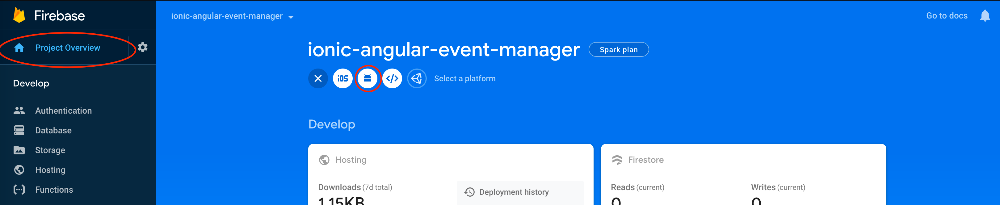
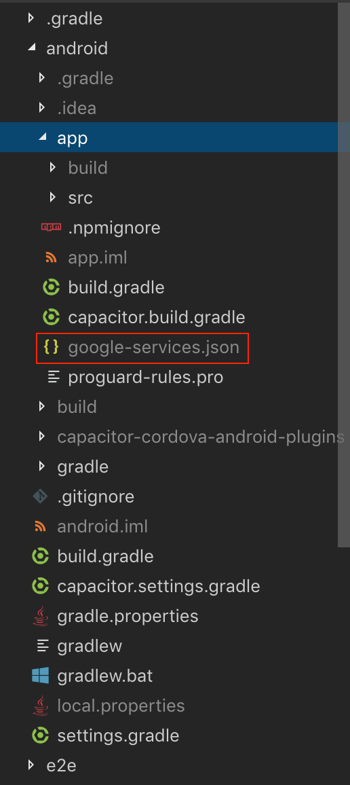
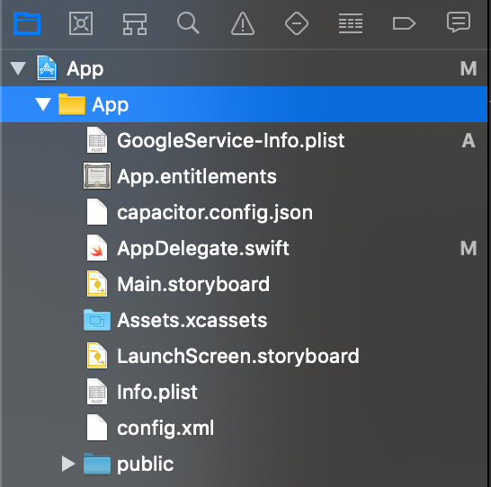
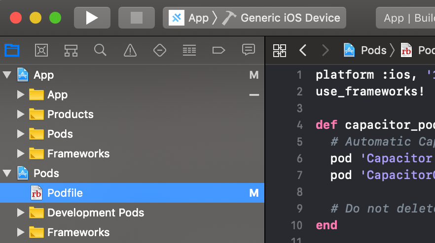
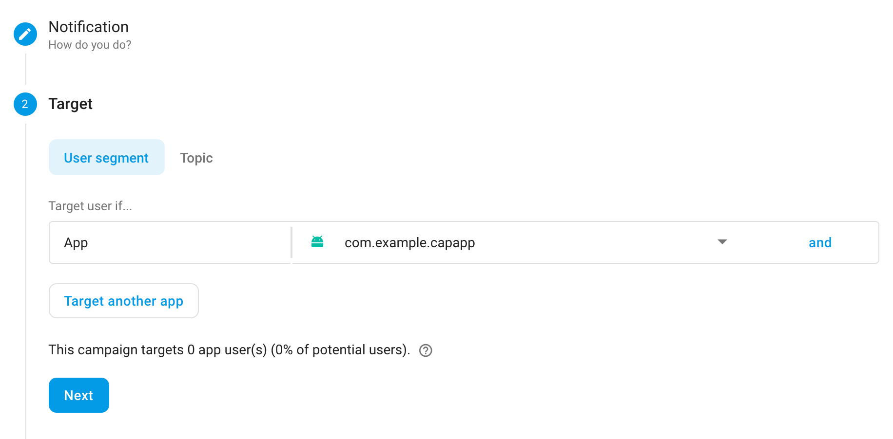
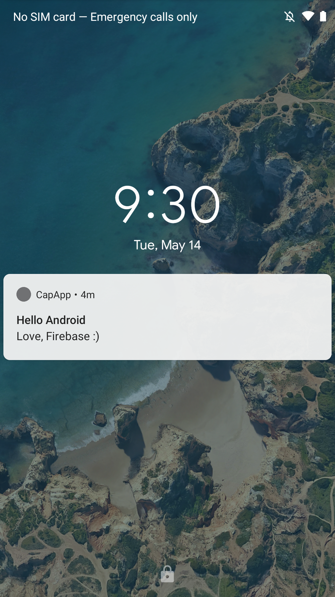
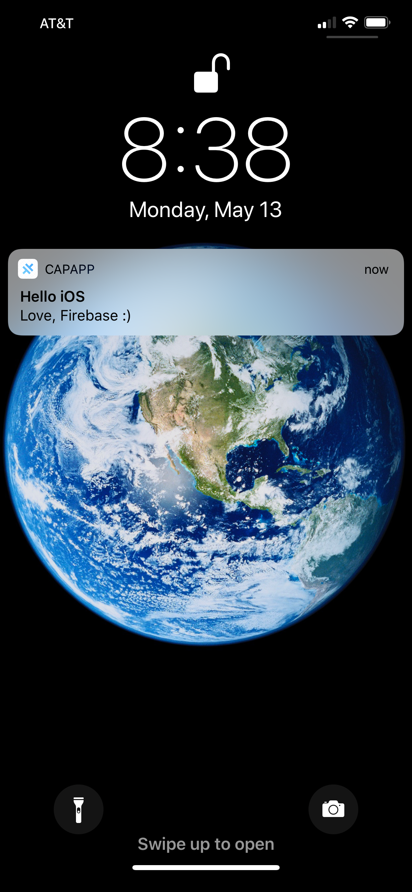
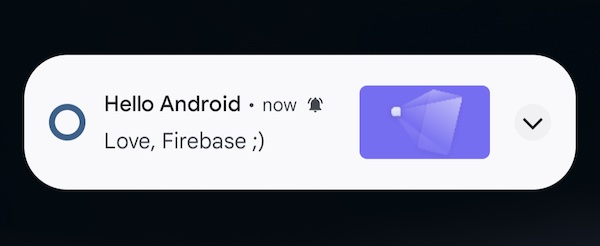
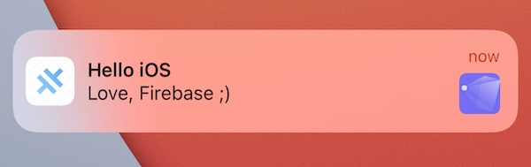

# Push通知をIonic + Angularアプリ上でFirebaseとともに使う

**Webフレームワーク**: Angular
**プラットフォーム**: iOS, Android

アプリケーション開発者がユーザーに提供する最も一般的な機能の 1 つは、プッシュ通知です。このチュートリアルでは、 [Firebase Cloud Messaging](https://firebase.google.com/docs/cloud-messaging) を iOS と Android で動作させるために必要なすべての手順について説明します。

Firebase からのプッシュ通知の登録とモニタリングを行うために、Ionic+Angular アプリケーションで [Push Notification API for Capacitor](https://capacitorjs.jp/docs/apis/push-notifications) を利用します。

## 要件

Capacitor を使用して iOS および Android アプリケーションを構築およびデプロイするには、少しばかりのセットアップが必要です。先に進む前に、 [指示に従って必要な Capacitor の依存関係をここにインストールしてください](/main/getting-started/environment-setup.md) 。

iOS でプッシュ通知をテストするためには、Apple は、 [有料の Apple Developer Account](https://developer.apple.com/) を要求します。

また、プッシュ通知には Firebase を使用していますので、Firebase SDK を使用している他の Cordova プラグインを使用している場合は、それらが最新バージョンであることを確認してください。

## Ionic Capacitorアプリの準備

既存のIonicアプリがある場合は、このセクションをスキップしてください。ない場合は、まずIonicアプリを作成しましょう。

お好みのターミナルで、最新バージョンのIonic CLIをインストールします：

```bash
npm install -g @ionic/cli
```

次に、CLIを使用して**blank**スタータープロジェクトに基づいた新しいIonic Angularアプリを作成し、**capApp**と呼びます：

```bash
ionic start capApp blank --type=angular
```

アプリケーションが正常に作成されたら、新しく作成されたプロジェクトディレクトリに移動します：

```bash
cd capApp/
```

最後に、`capacitor.config.ts`の`appId`を編集します。

```diff
const config: CapacitorConfig = {
- appId: 'io.ionic.starter',
+ appId: 'com.mydomain.myappnam',
  appName: 'capApp',
  webDir: 'www'
};
```

## アプリのビルドとプラットフォームの追加

このプロジェクトにネイティブプラットフォームを追加する前に、アプリを少なくとも1回ビルドする必要があります。Webビルドにより、Capacitorが必要とするWebアセットディレクトリ（Ionic Angularプロジェクトでは`www`フォルダ）が作成されます。

```bash
ionic build
```

次に、iOSとAndroidプラットフォームをアプリに追加しましょう。

```bash
ionic cap add ios
ionic cap add android
```

これらのコマンドを実行すると、プロジェクトのルートに`android`と`ios`の両方のフォルダが作成されます。これらは完全に独立したネイティブプロジェクトの成果物であり、Ionicアプリの一部と見なす必要があります（つまり、ソース管理にチェックインします）。

## Capacitorプッシュ通知APIの使用

まず、Capacitorプッシュ通知プラグインをインストールする必要があります

```bash
npm install @capacitor/push-notifications
npx cap sync
```

次に、Firebaseに進む前に、Capacitor Push Notification APIを使用してアプリケーションがプッシュ通知に登録できることを確認する必要があります。また、通知が届いてアプリがデバイスで開いているときに通知のペイロードを表示する`alert`を追加します（代わりに`console.log`文を使用することもできます）。

アプリで`home.page.ts`ファイルに移動し、`import`文と`const`を追加してCapacitor Push APIを使用します：

```typescript
import {
  ActionPerformed,
  PushNotificationSchema,
  PushNotifications,
  Token,
} from '@capacitor/push-notifications';
```

次に、プッシュ通知の登録と監視のためのAPIメソッドを含む`ngOnInit()`メソッドを追加します。また、何が起きているかを監視するために、いくつかのイベントに`alert()`を追加します：

```typescript
export class HomePage implements OnInit {
  ngOnInit() {
    console.log('Initializing HomePage');

    // プッシュ通知の使用許可を要求
    // iOSはユーザーに許可を求め、許可されたかどうかを返す
    // Androidは許可を求めずにそのまま許可する
    PushNotifications.requestPermissions().then(result => {
      if (result.receive === 'granted') {
        // Apple / Googleに登録してAPNS/FCM経由でプッシュを受信
        PushNotifications.register();
      } else {
        // エラーを表示
      }
    });

    // 成功した場合、通知を受信できるはず
    PushNotifications.addListener('registration',
      (token: Token) => {
        alert('Push registration success, token: ' + token.value);
      }
    );

    // セットアップに問題があり、プッシュが動作しない
    PushNotifications.addListener('registrationError',
      (error: any) => {
        alert('Error on registration: ' + JSON.stringify(error));
      }
    );

    // アプリがデバイスで開いている場合、通知ペイロードを表示
    PushNotifications.addListener('pushNotificationReceived',
      (notification: PushNotificationSchema) => {
        alert('Push received: ' + JSON.stringify(notification));
      }
    );

    // 通知をタップしたときに呼び出されるメソッド
    PushNotifications.addListener('pushNotificationActionPerformed',
      (notification: ActionPerformed) => {
        alert('Push action performed: ' + JSON.stringify(notification));
      }
    );
  }
}
```

`home.page.ts`の完全な実装は以下の通りです：

```typescript
import { Component, OnInit } from '@angular/core';

import {
  ActionPerformed,
  PushNotificationSchema,
  PushNotifications,
  Token,
} from '@capacitor/push-notifications';

@Component({
  selector: 'app-home',
  templateUrl: 'home.page.html',
  styleUrls: ['home.page.scss'],
})
export class HomePage implements OnInit {
  ngOnInit() {
    console.log('Initializing HomePage');

    // プッシュ通知の使用許可を要求
    // iOSはユーザーに許可を求め、許可されたかどうかを返す
    // Androidは許可を求めずにそのまま許可する
    PushNotifications.requestPermissions().then(result => {
      if (result.receive === 'granted') {
        // Apple / Googleに登録してAPNS/FCM経由でプッシュを受信
        PushNotifications.register();
      } else {
        // エラーを表示
      }
    });

    PushNotifications.addListener('registration', (token: Token) => {
      alert('Push registration success, token: ' + token.value);
    });

    PushNotifications.addListener('registrationError', (error: any) => {
      alert('Error on registration: ' + JSON.stringify(error));
    });

    PushNotifications.addListener(
      'pushNotificationReceived',
      (notification: PushNotificationSchema) => {
        alert('Push received: ' + JSON.stringify(notification));
      },
    );

    PushNotifications.addListener(
      'pushNotificationActionPerformed',
      (notification: ActionPerformed) => {
        alert('Push action performed: ' + JSON.stringify(notification));
      },
    );
  }
}
```

この後、新しいビルドを生成し、Capacitorに変更を知らせます。以下で行えます：

```bash
ionic build
npx cap copy
```

## FirebaseでアプリのプロジェクトCreate作成

Firebase Cloud Messagingをアプリケーションに接続してプッシュ通知を送信する前に、Firebaseでプロジェクトを開始する必要があります。

[Firebaseコンソール](https://console.firebase.google.com/)に移動し、**Add project**ボタンをクリックします。

プロジェクトに名前を付け、Firebase利用規約に同意し、**Create project**をクリックして続行します。プロジェクトIDは自動的に生成されます。

## Android

### AndroidアプリとFirebaseの統合

このセクションは、[Firebaseコンソールを使用したFirebaseのセットアップドキュメント](https://firebase.google.com/docs/android/setup?authuser=0)とほぼ同じ内容です。Capacitor固有の注意事項については以下を参照してください。

Firebaseプロジェクトのプロジェクト概要ページに移動し、上部の**Android**アイコンをクリックして新しいAndroidアプリケーションを追加します。



次の画面では、アプリケーションに関するいくつかの情報が求められます。

- **Androidパッケージ名**は`capacitor.config.ts`ファイルの**appId**と一致する必要があります
- このCapacitorアプリIDには`com.mydomain.myappname`を使用したため、このエントリにもそれを使用します
- ニックネームとデバッグ署名証明書はオプションです

次に**Register app**ボタンをクリックします。

### `google-services.json`ファイルのダウンロードと使用

次のプロンプトで`google-services.json`ファイルのダウンロードが求められます。このファイルには、CapacitorアプリがAndroidからFirebaseに接続するために必要な情報が含まれています。

`google-services.json`ファイルをローカルマシンにダウンロードします。次に、ファイルをCapacitor Androidプロジェクトディレクトリ、具体的には`android/app/`の下に移動します。



`@capacitor/push-notifications`は`build.gradle`ファイルに`firebase-messaging`のバージョンを自動的に含めるため、プロジェクトに依存関係を追加する必要はありません。

## iOS

### 前提条件

iOSプッシュ通知は、Androidよりも設定がかなり複雑です。iOSアプリケーションでプッシュ通知をテストできるようになる前に、[有料のApple Developerアカウント](https://developer.apple.com/)を持ち、以下の項目を処理する必要があります：

1. Apple Developer PortalでiOSアプリケーションの[適切な開発または本番証明書とプロビジョニングプロファイルをセットアップする](https://help.apple.com/xcode/mac/current/#/dev60b6fbbc7)
2. Apple Developer Portalで開発または本番用の[APNS証明書またはキーを作成する](https://developer.apple.com/documentation/usernotifications/setting_up_a_remote_notification_server/establishing_a_certificate-based_connection_to_apns)
3. Xcodeでアプリケーションの[プッシュ通知機能が有効になっていることを確認する](https://help.apple.com/xcode/mac/current/#/dev88ff319e7)

### ネイティブiOSアプリとFirebaseの統合

この部分は上記のAndroidセクションと非常に似ていますが、いくつかの重要な違いがあります。

まず、Firebaseプロジェクトの**プロジェクト概要**ページに移動します。このガイドに従っている場合、ページの上部にAndroidアプリケーションがすでにリストされているはずです。

FirebaseプロジェクトにiOSを追加するには、**Add App**ボタンをクリックし、**iOS**プラットフォームを選択します。

次の画面では、アプリケーションに関するいくつかの情報が求められます。

- **iOSバンドルID**は`capacitor.config.ts`ファイルの**appId**と一致する必要があります
- このCapacitorアプリIDには`com.mydomain.myappname`を使用したため、このエントリにもそれを使用します
- アプリニックネームとApp Store IDはオプションです

次に**Register app**ボタンをクリックします。

### iOSアプリに`GoogleService-Info.plist`ファイルを追加

_注：これはAndroidアプリに使用したファイルと**同じではありません**。_

提供された`GoogleService-Info.plist`をローカルマシンにダウンロードします。

次にXcodeを開きます...

```bash
npx cap open ios
```

...そして、Firebaseの指示に従って`.plist`ファイルをXcodeプロジェクトに移動し、すべてのターゲットに追加することを確認してください。




### Firebase SDKの追加

iOSのPush Notification APIは、依存関係管理にSwift Package ManagerまたはCocoaPodsを使用します。Firebaseを使用するように設定する必要があります。

#### Swift Package Manager（SPM）を使用する場合

SPMを使用してSDKを追加するには、`ios/App/App.xcodeproj`を変更する必要があります

まず、`npx cap open ios`を実行するか、Finderでファイルをダブルクリックして`ios/App/App.xcodeproj`をXcodeで開きます。

以下のように、左側でAppを選択し、右側でパッケージ依存関係を選択します。


次に、プラスアイコンを選択して新しいパッケージを追加すると、以下のようなものが表示されるはずです。


検索ボックスに`https://github.com/firebase/firebase-ios-sdk`と入力し、「Add Package」を選択します。


スクロールして、AppターゲットにFirebase Messagingを追加します。


「Add Package」をクリックし、処理が完了するまで待ちます。完了すると、この画像のようなものが表示されるはずです。


#### CocoaPodsを使用する場合

これを行うには、Xcodeの`Pods`の下にある`Podfile`を変更する必要があります：



Appターゲット用に提供されたCocoaPodsにFirebaseを追加する必要があります。そのためには、`target 'App'`セクションに`pod FirebaseMessaging`を追加します：

```ruby
target 'App' do
  capacitor_pods
  # ここにPodを追加
  pod 'FirebaseMessaging' # この行を追加
end
```

`Podfile`は以下のようになるはずです：

```ruby
require_relative '../../node_modules/@capacitor/ios/scripts/pods_helpers'

platform :ios, '14.0'
use_frameworks!

# 新しいCordovaプラグインがインストールされた後に
# Product -> Clean Build Folderが必要なPodsのXcodeキャッシュを回避するための回避策
# CocoaPods 1.6以降が必要
install! 'cocoapods', :disable_input_output_paths => true

def capacitor_pods
  pod 'Capacitor', :path => '../../node_modules/@capacitor/ios'
  pod 'CapacitorCordova', :path => '../../node_modules/@capacitor/ios'
  pod 'CapacitorApp', :path => '../../node_modules/@capacitor/app'
  pod 'CapacitorHaptics', :path => '../../node_modules/@capacitor/haptics'
  pod 'CapacitorKeyboard', :path => '../../node_modules/@capacitor/keyboard'
  pod 'CapacitorPushNotifications', :path => '../../node_modules/@capacitor/push-notifications'
  pod 'CapacitorStatusBar', :path => '../../node_modules/@capacitor/status-bar'
end

target 'App' do
  capacitor_pods
  # ここにPodを追加
  pod 'FirebaseMessaging'
end

post_install do |installer|
  assertDeploymentTarget(installer)
end
```

### プロジェクトの更新

次に、適切なFirebase CocoaPodがインストールされたiOSプロジェクトを更新する必要があります。

_注：CocoaPodsが適切なファイル/依存関係をすべてダウンロードする必要があるため、この部分には時間がかかることがあります。_

```bash
npx cap update ios
```

### 初期化コードの追加

iOSアプリの起動時にFirebaseに接続するには、`AppDelegate.swift`ファイルに以下を追加する必要があります。

まず、ファイルの先頭に`import`を追加します：

```swift
import FirebaseCore
import FirebaseMessaging
```

...次に、`AppDelegate.swift`ファイルの`application(didFinishLaunchingWithOptions)`メソッドに、Firebase用の設定メソッドを初期化コードに追加します。

```swift
FirebaseApp.configure()
```

次に、プッシュ登録イベントを正しく処理するために、以下の2つのメソッドを追加する必要があります：

```swift
func application(_ application: UIApplication, didRegisterForRemoteNotificationsWithDeviceToken deviceToken: Data) {
  Messaging.messaging().apnsToken = deviceToken
  Messaging.messaging().token(completion: { (token, error) in
    if let error = error {
        NotificationCenter.default.post(name: .capacitorDidFailToRegisterForRemoteNotifications, object: error)
    } else if let token = token {
        NotificationCenter.default.post(name: .capacitorDidRegisterForRemoteNotifications, object: token)
    }
  })
}

func application(_ application: UIApplication, didFailToRegisterForRemoteNotificationsWithError error: Error) {
  NotificationCenter.default.post(name: .capacitorDidFailToRegisterForRemoteNotifications, object: error)
}
```

完成した`AppDelegate.swift`ファイルは以下のようになるはずです：

```swift
import UIKit
import Capacitor
import FirebaseCore
import FirebaseMessaging

@UIApplicationMain
class AppDelegate: UIResponder, UIApplicationDelegate {

  var window: UIWindow?


  func application(_ application: UIApplication, didFinishLaunchingWithOptions launchOptions: [UIApplication.LaunchOptionsKey: Any]?) -> Bool {
    // アプリケーション起動後のカスタマイズのためのオーバーライドポイント
    FirebaseApp.configure()
    return true
  }

  func application(_ application: UIApplication, didRegisterForRemoteNotificationsWithDeviceToken deviceToken: Data) {
    Messaging.messaging().apnsToken = deviceToken
    Messaging.messaging().token(completion: { (token, error) in
      if let error = error {
          NotificationCenter.default.post(name: .capacitorDidFailToRegisterForRemoteNotifications, object: error)
      } else if let token = token {
          NotificationCenter.default.post(name: .capacitorDidRegisterForRemoteNotifications, object: token)
      }
    })
  }

  func application(_ application: UIApplication, didFailToRegisterForRemoteNotificationsWithError error: Error) {
    NotificationCenter.default.post(name: .capacitorDidFailToRegisterForRemoteNotifications, object: error)
  }
```

### APNS証明書またはキーをFirebaseにアップロード

最初から手順に従っている場合、Apple Developer PortalでApple APNS証明書またはAPNS認証キーを作成しているはずです。FirebaseがAPNSと通信してアプリケーションにプッシュ通知を送信できるようになる前に、これらのいずれかをFirebaseにアップロードする必要があります。

証明書または認証キーをアップロードするには、**プロジェクト概要**ページから：

1. iOSアプリケーションをクリックし、**Settings**歯車アイコンをクリックします。
2. 設定ページで、**Cloud Messaging**タブをクリックします。
3. **iOS app configuration**ヘッダーの下で、提供された**Upload**ボタンを使用して認証キーまたは証明書をアップロードします。

## テスト通知の送信

さて、楽しい部分です - FirebaseからのプッシュがAndroidとiOSで動作していることを確認しましょう！

`home.page.ts`ページが通知を登録して受信できるように、AndroidまたはiOSでアプリケーションを起動する必要があります。

AndroidプロジェクトをAndroid Studioで開くには：

```bash
npx cap open android
```

iOSプロジェクトをXcodeで開くには：

```bash
npx cap open ios
```

プロジェクトが開いたら、Android StudioまたはXcodeのRun機能を使用してデバイスにアプリケーションをサイドロードします。アプリはホームページで起動するはずです。

_注：iOSでは、アプリの通知を許可するかどうかを尋ねるポップアップが表示されます - **Allow notifications**を選択してください！_

アプリが正常に登録され、上記のコードに従っている場合、成功メッセージを含むアラートが表示されるはずです！

次に、通知がデバイスで受信されるかどうかをテストします。通知を送信するには、Firebaseで、プロジェクトペインのGrowヘッダーの下にある**Cloud Messaging**セクションに移動します。

次に、**New Notification**ボタンを選択します。

通知を作成する際には、以下の情報のみを指定する必要があります：

1. 通知のテキスト
2. タイトル（Androidのみ、iOSではオプション）
3. ターゲット（ユーザーセグメントまたはトピック；iOSまたはAndroidアプリ自体をターゲットにすることをお勧めします、以下を参照）



4. スケジュール（これは「Now」のままにしておく）

その時点で、作成した通知を**Review**し、**Publish**を選択して通知を送信できます。

アプリケーションを正しくセットアップしていれば、Firebaseで作成したプッシュ通知を含むアラートがホーム画面にポップアップ表示されます。その後、通知をタップすると、上記のコードに従って`pushActionPerformed`イベントの`alert`が表示されるはずです。





## プッシュ通知の画像

以下のガイドに従って、オプションでプッシュ通知の一部として画像を含めることができます。

:::tip
Firebase Messaging SDKは、ペイロードの一部として`ImageUrl`プロパティを含めて表示できます。URLは`https://`である必要があり、サイズは300kb未満である必要があります。
:::

### Androidでの画像
`@capacitor/push-notifications`を使用すると、Androidは自動的に画像を表示します。[Firebaseコンソール](https://console.firebase.google.com/)で`Notification image`を設定してテストすると、プッシュ通知は以下のスクリーンショットのようにAndroidデバイスに表示されます：



### iOSでの画像
iOSでは、プッシュ通知に画像を表示するためにプロジェクトに[Notification Service Extension](https://developer.apple.com/documentation/usernotifications/unnotificationserviceextension)を追加する必要があります。

XCodeで：
- `File` > `New` > `Target`をクリック
- `Notification Service Extension`を選択して`Next`をクリック
- `Product Name`を入力（例：`pushextension`）
- Teamを選択
- `Finish`をクリック
- 確認されたら`Activate`をクリック

ターゲットのリストから`pushextension`を選択し、次に：
- `Signing & Capabilities`をクリック
- `+ Capability`をクリック
- `Push Notifications`を選択
- デプロイメントターゲットを`iOS 16.4`（またはXcodeが選択したもの）から`iOS 14.0`に変更

:::note
拡張機能のデプロイメントターゲットを変更しないと、古いバージョンのiOSのデバイスでは画像が表示されません。
:::

Firebase Messagingを拡張機能に追加するには、`Podfile`を開いて以下を追加します：
```ruby
target 'pushextension' do
  pod 'FirebaseMessaging'
end
```

次にCocoaPodsを更新するために以下を実行します：
```bash
npx cap update ios
```

次に`NotificationService.swift`（`pushextension`という名前のフォルダにあります）を開き、内容を以下に置き換えます：

```swift
import UserNotifications
import FirebaseMessaging

class NotificationService: UNNotificationServiceExtension {
    var contentHandler: ((UNNotificationContent) -> Void)?
    var bestAttemptContent: UNMutableNotificationContent?

    override func didReceive(_ request: UNNotificationRequest, withContentHandler contentHandler: @escaping (UNNotificationContent) -> Void) {
        guard let content = request.content.mutableCopy() as? UNMutableNotificationContent else { return }
        self.contentHandler = contentHandler
        self.bestAttemptContent = content
        
        FIRMessagingExtensionHelper().populateNotificationContent(content, withContentHandler: contentHandler)
    }
    
    override func serviceExtensionTimeWillExpire() {
        guard let contentHandler = contentHandler,
              let bestAttemptContent =  bestAttemptContent else { return }
        
        contentHandler(bestAttemptContent)
    }
}
```

これで[Firebaseコンソール](https://console.firebase.google.com/)からプッシュ通知をテストできます。`Notification image`を設定し、iOSアプリを選択することを忘れないでください。iOSデバイスに届くと、以下のように右側に表示されます：


