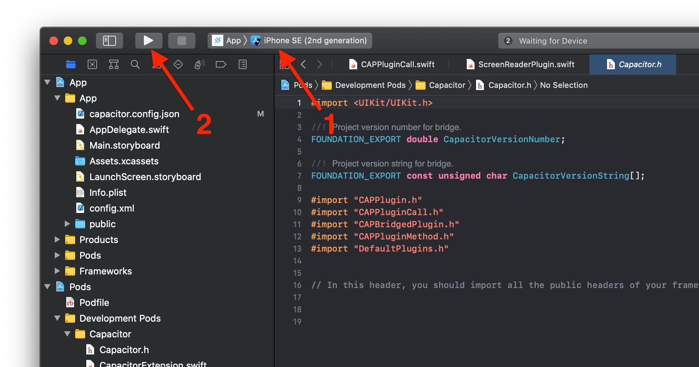

# Capacitor iOS ドキュメンテーション

Capacitor は Native の iOS ブリッジを特徴としており、開発者は JavaScript と Native Swift または Objective-C コードとの間で通信できます。

Capacitor の iOS アプリは、Xcode と　[CocoaPods](https://cocoapods.org/)　で設定・管理されています。

## iOS サポート

iOS 14+に対応しています。Xcode 16.0+が必要です（[環境セットアップ](/main/getting-started/environment-setup.md#ios-requirements) を参照）。Capacitorは非推奨の[UIWebView](https://developer.apple.com/documentation/uikit/uiwebview)ではなく、[WKWebView](https://developer.apple.com/documentation/webkit/wkwebview)を使用します。

## iOS プラットフォームの追加

まず、 `@capacitor/ios` パッケージをインストールします。

```bash
npm install @capacitor/ios
```

そして iOS プラットフォームを追加します。

```bash
npx cap add ios
```

## iOS プロジェクトを開く

Xcode でプロジェクトを開くには、次のように実行します:

```bash
npx cap open ios
```

または、Xcode を手動で起動することもできます:

```bash
open ios/App/App.xcworkspace
```

## アプリの実行

アプリを実行するには、コマンドラインで実行する方法と、Xcode で実行する方法があります。

### コマンドラインでの実行

デバイスやシミュレータでプロジェクトを実行するには、次のように実行します:

```bash
npx cap run ios
```

コマンドを実行すると、ターゲットを選択するように促されます。詳しくは [ `run` をご覧ください](/cli/commands/run.md).

### Xcode での実行

Xcode では、まずデバイスやシミュレータを選択し、再生ボタンをクリックしてアプリを実行します。



## トラブルシューティング

使い始めてから何か問題が発生した場合は、 [iOS トラブルシューティングガイド](/main/ios/troubleshooting.md)  を参考にしてください。ヘルプが必要な場合は、お気軽に [ディスカッションを開いてください](https://github.com/ionic-team/capacitor/discussions/) をご利用ください。

## 次のステップ

これで、アプリの開発と構築を続ける準備が整いました。利用可能な様々な API、Capacitor や Cordova のプラグイン、またはカスタムネイティブコードを使用して、アプリの残りの部分を構築してください。

## Further Reading

各トピックの詳細については、以下のガイドを参照してください。

[iOS の設定とパーミッションの設定 &#8250;](/main/ios/configuration.md)

[iOS 用のネイティブプラグインの構築 &#8250;](/plugins/creating-plugins/ios-guide.md)
