# Swift Package Manager

Swift Packagesは、ソフトウェアの依存関係のためのAppleの新しいファーストパーティツールです。従来、Capacitorは内部およびプラグインの依存関係を管理するためにCocoaPodsを使用していましたが、今こそサポートされたソリューションに移行する時です。

Capacitor 6では、CocoapodsまたはSwift Package Manager（SPM）のどちらかを選択できるようになりました。現在のほとんどのcapacitor-teamサポートプラグインはSPMをサポートしており、特に<a href="https://github.com/ionic-team/capacitor-plugins">capacitor-plugins</a>のプラグインが該当します。

SPMを使用するためにCapacitorの作業方法を大きく変更する必要がないように最善を尽くしましたが、いくつか理解しておくべきことがあります。

## 仕組み

CapacitorプロジェクトがSPMを使用している場合、プロジェクトのすべての依存関係を参照する場所として機能する「ベースSPM」パッケージを使用します：

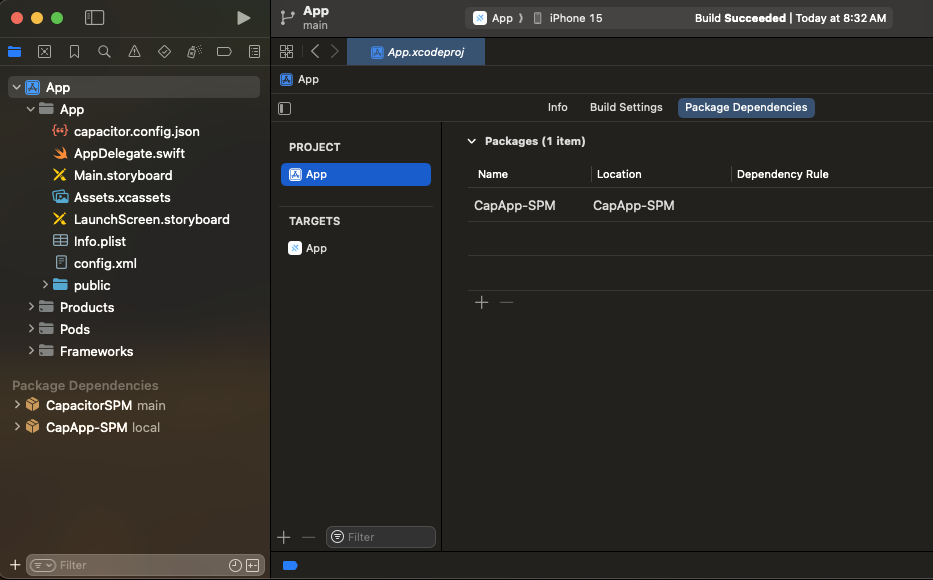

Capacitor CLIは、新しいプラグインを同期するときにCapApp-SPMパッケージを変更します。ここに含まれる内容には触れないようにすることが重要です。CLIは変更を加える可能性があります。

## 新しいCapacitorプロジェクトでSPMを使用する

まず、通常の`npm init @capacitor/app@latest`から始めます。

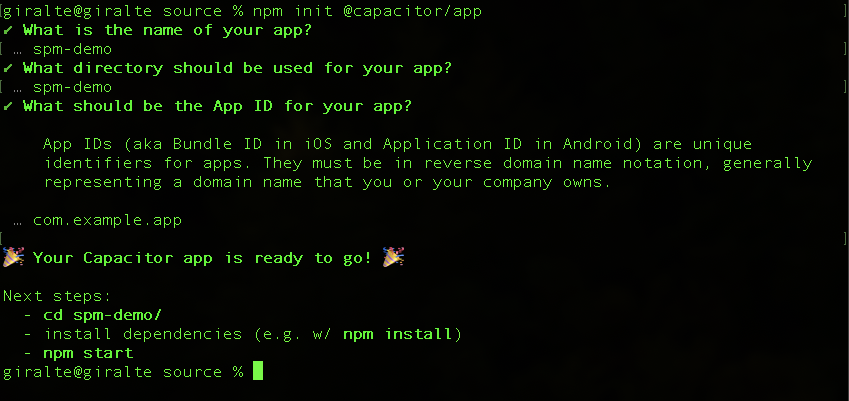

次に、プロジェクトにiOSプラットフォームを追加します：

`npm install @capacitor/ios`

次に、ウェブプロジェクトをビルドします。

`npm run build`

完了したら、iOSプロジェクトを追加します。通常の追加コマンドに`--packagemanager SPM`オプションを追加する必要があります。

`npx cap add ios --packagemanager SPM`

これで、`npx cap open ios`を使用してiOSプロジェクトを開き、そこからアプリを実行できます。

---

### SPMを使用してCapacitorプラグインを追加および使用する

このプロジェクトにプラグインを追加し、そのプラグインを使用してみましょう。

まず、Capacitor Appプラグインをインストールします。

`npm install @capacitor/app`

次に、ウェブアプリを同期します。これにより、AppプラグインSPMがiOSプロジェクトに追加されます。

`npx cap sync`

You can now use the App plugin normally.

## Using SPM in an existing Capacitor Project

First, ensure you have a backup of the current state of your project, either in source control or elsewhere.

### Deleting your iOS Directory

If you **have not manually changed your Xcode Project at all**, one option to migrate is to delete the `ios` directory and then run `npx cap add ios --packagemanager SPM`. This will remove the CocoaPods template project and replace it with the SPM template project.  

### Using our migration tool

The Capacitor CLI has a command to help migrate from CocoaPods to Swift Package Manager. However, two manual steps are still required. Some things to note are: Projects with Cordova plugins should work, but some plugins may not work correctly as we have to generate a `Package.swift` file for them. In addition, projects that use capacitor plugins that do not have SPM versions available, will fail to work properly and will show a warning about the incompatible plugins during migration and when running `npx cap sync`.

To start, run `npx cap spm-migration-assistant` in the root of your project.

This tool will:
  - Run `pod deintegrate` removing CocoaPods
  - Delete the `Podfile`, `App.xcworkspace`, and `Podfile.lock`
  - Create a `CapApp-SPM` directory with the needed files
  - Generate a `Package.swift` from your plugins, and warn you if any can't be included.
  - Add a `debug.xcconfig` to your ios project directory

Then run `npx cap open ios` and you should see something similar to this:

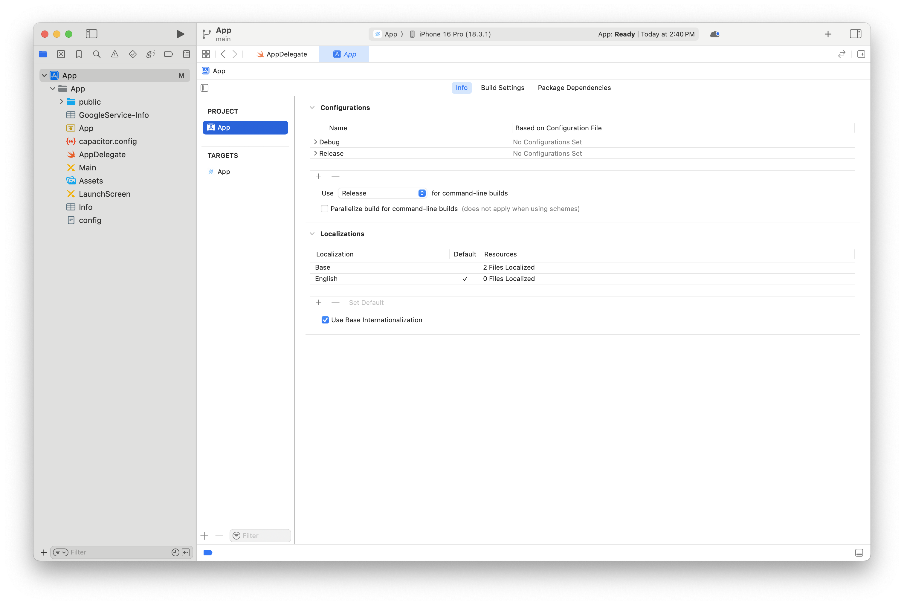

Highlight App, and Select the Package Dependencies tab, and on this page press the + symbol to add a dependency:

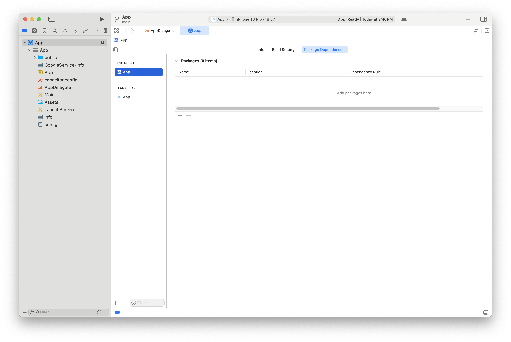

You should see something similar to the below - select Add Local... from the dialog:

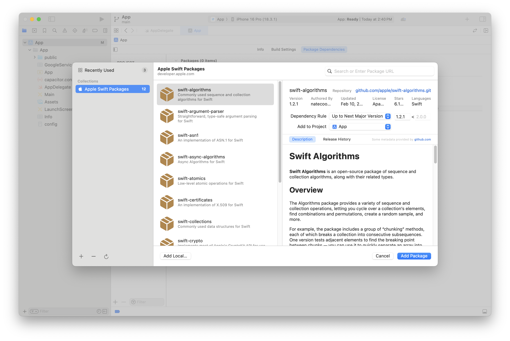

Select CapApp-SPM in this dialog and click Add Package:

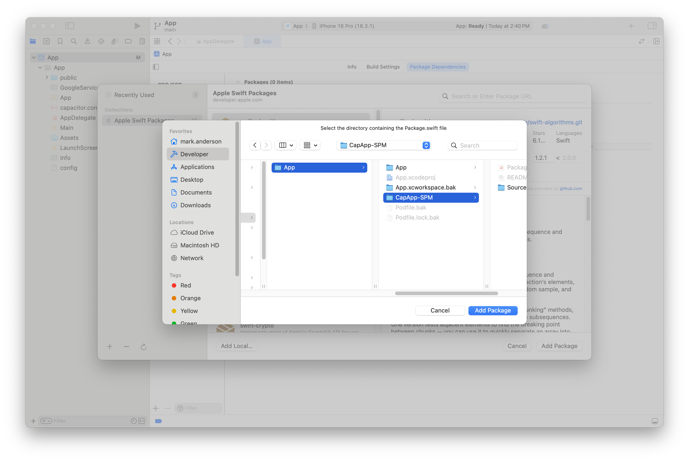

Click Add Package again when this screen shows up: 

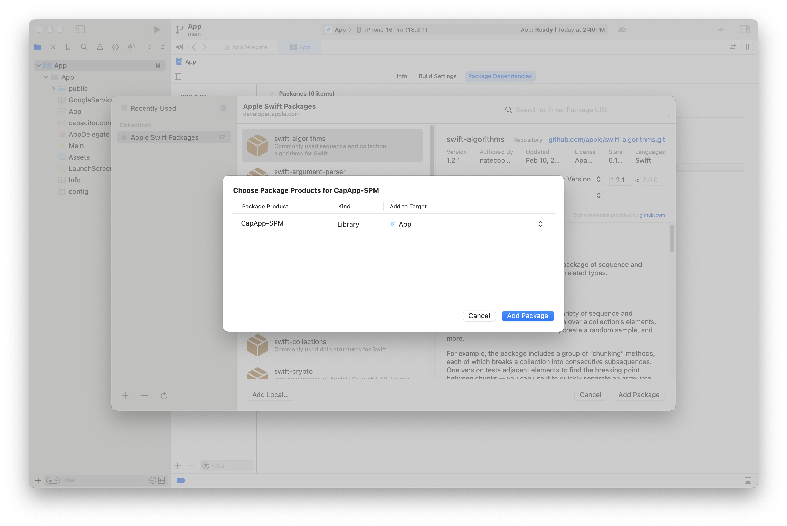

When you are done, you should see a screen like this. Now, move onto the next section about Adding `debug.xconfig`

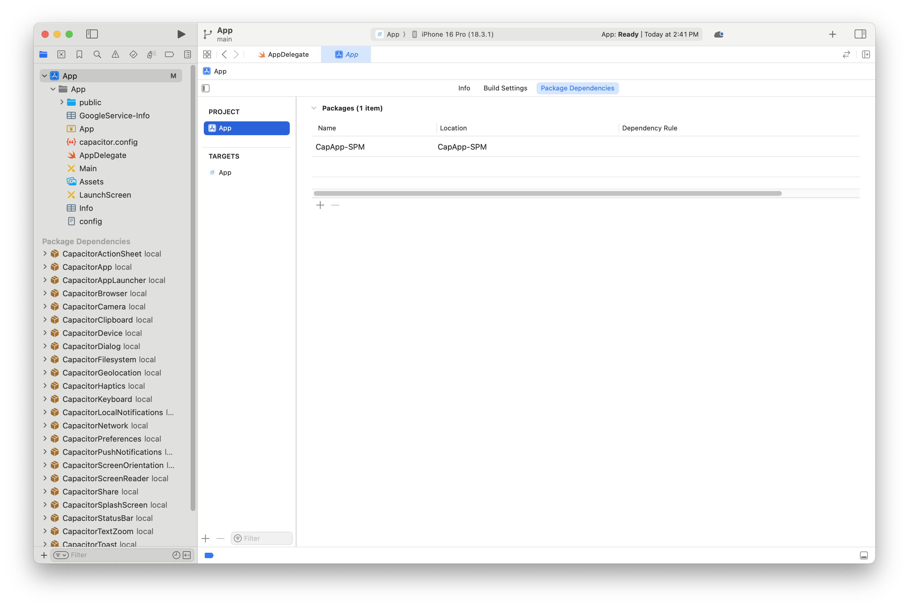

#### Adding debug.xcconfig to project 

From the app info tab, select Add Configuration file...

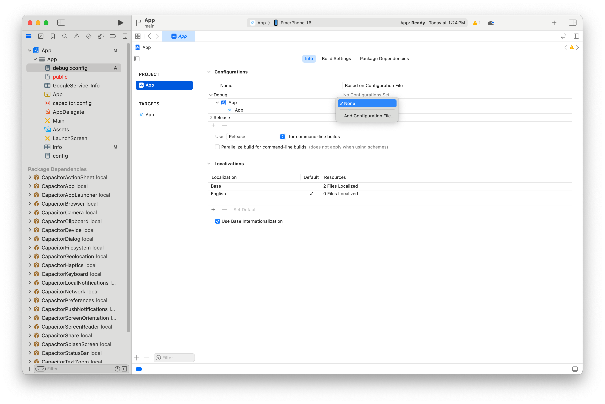

Then select the file called `debug.xcconfig`

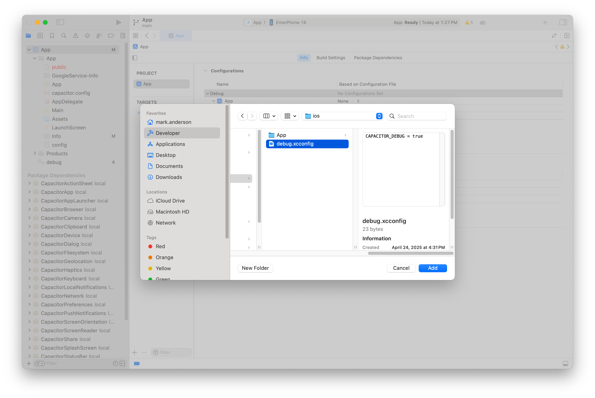

Finally select xcconfig as your selection

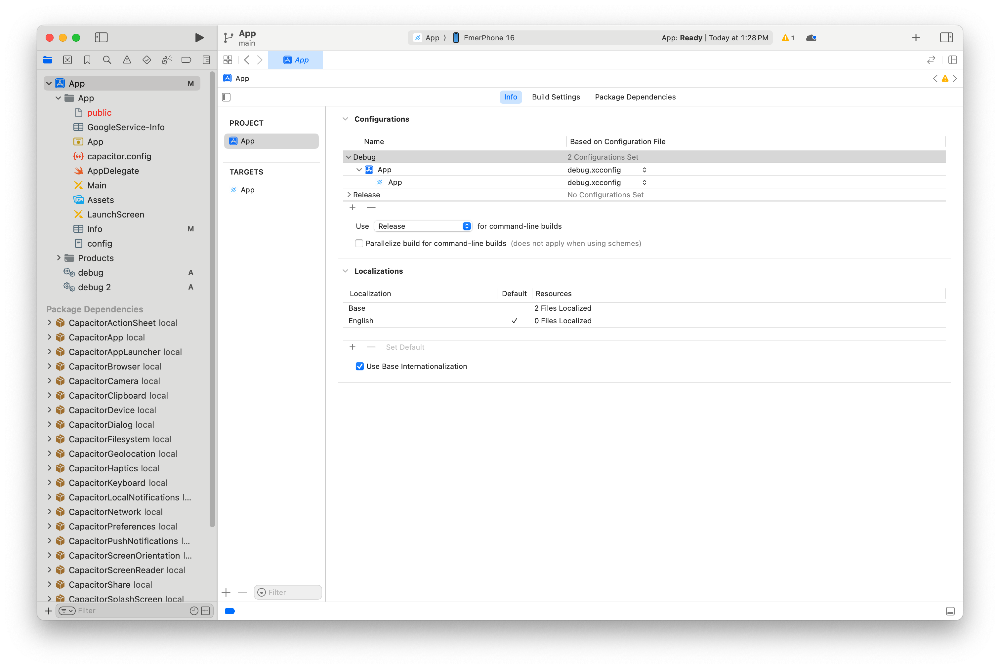

At this point you're done and can build and work as normal.

### Converting existing plugins to SPM

If your plugin only contains Swift aside from the required `[Name]Plugin.m` and `[Name]Plugin.h` you can use the [capacitor-plugin-converter](https://github.com/ionic-team/capacitor-plugin-converter).

This tool will do the following changes:

- Add the following required things to your main swift plugin file, `[Name]Plugin.swift`:
  - Add Conformance to the `CAPBridgedPlugin` protocol to your class.
  - Add 3 variables to your class. `identifier`, `jsName`, and `pluginMethods`:
    - `identifier` will correspond to the first argument to the `CAP_PLUGIN` macro.
    - `jsName` will correspond to the second argument to the `CAP_PLUGIN` macro.
    - `pluginMethods` will be an array of the methods passed to the `CAP_PLUGIN` macro.
- A `Package.swift` file will be created at the root of your plugin folder.
- The following files will be removed as they are no longer needed:
  - `Plugin.xcodeproj`
  - `Plugin.xcworkspace`
  - `Plugin/Info.plist`
  - `PluginTests/Info.plist`
  - `Podfile`
- To fit SPM best practices, the Project files will be moved to `Sources` and `Tests` directories.
- The plugins `package.json` will get the following changes:
  - The files array will add these files or directories:
    - `ios/Sources`
    - `ios/Tests`
    - `Package.swift`
  - `verify:ios` will be changed to `xcodebuild -scheme YourPluginName -destination generic/platform=iOS` to allow it to continue to work as you expect.
- Your plugin podspec will be changed so that `s.source_files` now points to the `Sources` directory rather than the `Plugin` directory.

See the documentation in the repository at [capacitor-plugin-converter](https://github.com/ionic-team/capacitor-plugin-converter) for more.

### トラブルシューティング

プラグインを追加した後、Xcodeで「パッケージキャッシュをリセット」してみてください。

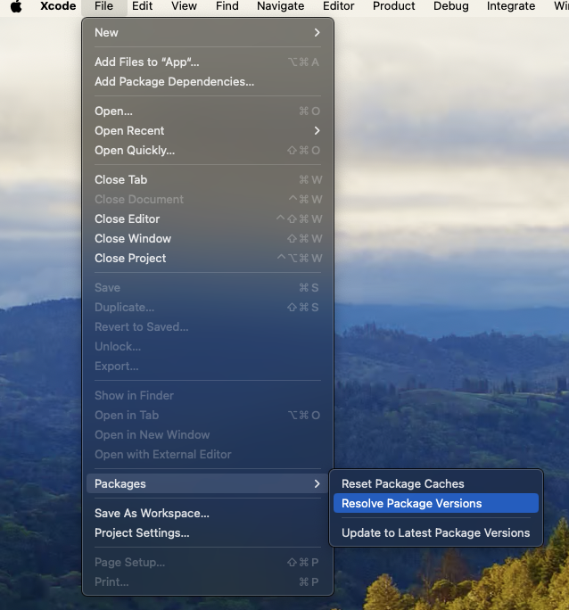
