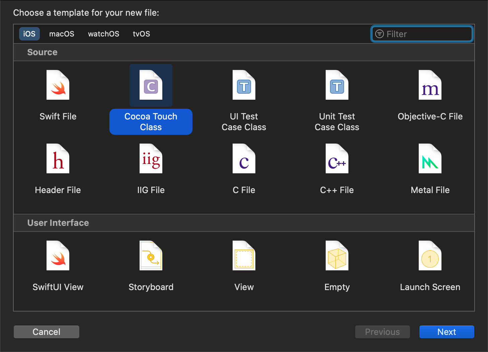

# カスタム ViewController

Capacitor 3.0 では、アプリケーション内で `CAPBridgeViewController` をサブクラス化できるようになりました。ほとんどのアプリケーションはこの機能を必要としませんが、いくつかの特殊なユースケースに対応するためのメカニズムがサポートされています。

## サブクラスを作成する場合

サブクラス化が必要になる例としては、実行時にCapacitorの設定値をオーバーライドしたり、[`WKWebViewConfiguration`](https://developer.apple.com/documentation/webkit/wkwebviewconfiguration)のプロパティをしたり、[`WKWebView`](https://developer.apple. com/documentation/webkit/wkwebview))を使用したり、[`viewDidLoad()`](https://developer.apple.com/documentation/uikit/uiviewcontroller/1621495-viewdidload)にコードを追加することを提案するサードパーティSDKを統合する、画面に表示される前にネイティブビューを操作する、または [カスタムプラグインを登録する](../ios/custom-code.md) 場合があります。

カスタムサブクラスを作成する必要がある場合は、いくつかの手順があります。

### Create `MyViewController.swift`

First, create a `MyViewController.swift` file by [opening Xcode](/main/ios/index.md#opening-the-ios-project), right-clicking on the **App** group (under the **App** target), selecting **New File...** from the context menu, choosing **Cocoa Touch Class** in the window, set the **Subclass of:** to `UIViewController` in the next screen, and save the file.




### Edit `Main.storyboard`

Next, select the `Main.storyboard` file in the Project Navigator, select the **Bridge View Controller** in the **Bridge View Controller Scene**, select the **Identity Inspector** on the right, and change the name of the custom class to `MyViewController`.


### Edit `MyViewController.swift`

Finally, select the `MyViewController.swift` file in the Project Navigator and edit it to import Capacitor and change the parent class:

```swift
import UIKit
import Capacitor

class MyViewController: CAPBridgeViewController {
    // additional code
}
```

You're done!

### Next Steps

Xcode should have already created a `viewDidLoad()` method for you when it generated the file but look over the inline documentation in [`CAPBridgeViewController`](https://github.com/ionic-team/capacitor/blob/main/ios/Capacitor/Capacitor/CAPBridgeViewController.swift) to find the Capacitor-specific methods you might need. Anything marked `open` is explicitly exposed for subclasses to override.
