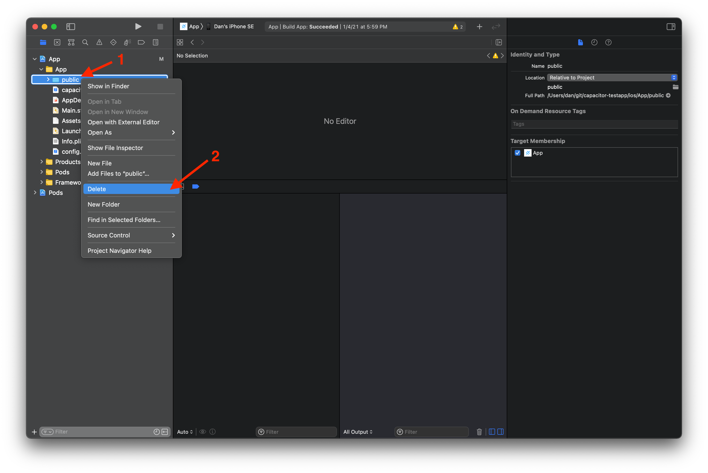
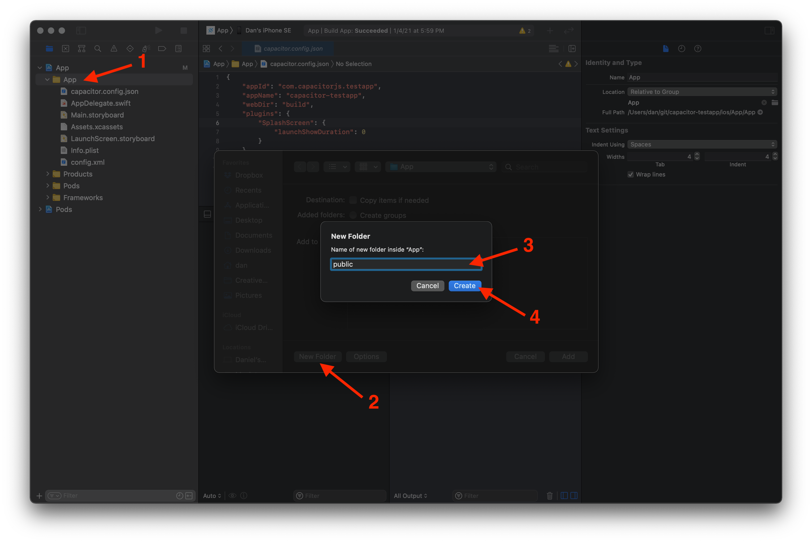

# アプリを Capacitor3.0 にアップデート

Capacitor 3 は、エコシステムに重要なアップデートとエキサイティングな新機能をもたらします。

[Capacitor 3.0 RC のアナウンスを読む &#8250;](https://ionicframework.com/blog/announcing-capacitor-3-0/)

> アプリを Capacitor3 にアップグレードした後、何かフィードバックがあれば [このディスカッション](https://github.com/ionic-team/capacitor/discussions/3994) で共有していただけませんか？ご意見をお待ちしております 💖

プラグインを Capacitor の新しいバージョンにアップグレードしたいと考えているプラグイン作者の方は、 [Upgrade Guide for Capacitor Plugins](/docs/updating/plugins/3-0) をご覧ください。

## NodeJS 12+

Node 8 は生産終了となりました。Node 10 は 2021 年 4 月 30 日に寿命を迎えます。Capacitor 3 は NodeJS 12 以上が必要です。(最新の LTS バージョンを推奨します。)

## Ionic CLI

If you are using the Ionic CLI, official Capacitor 3 support starts at version 6.16.0. We suggest upgrading to the latest version at this time via `npm install -g @ionic/cli`.

## Update Capacitor CLI and Core

```bash
npm install @capacitor/cli@latest-3 @capacitor/core@latest-3
```

## ES2017+

Capacitor 3 は ES5 ではなく、ES2017 の環境でビルドされるようになりました。また、 [プラグインテンプレートも ES2017 をターゲットに更新されました](https://github.com/ionic-team/capacitor/pull/3427/files#diff-b22b3d0cbb7d8f6fdfe1f6f1d9e84b7d) ので、サードパーティのプラグインもターゲットを更新することが推奨されます。

この変更は、Capacitor が公式にサポートしていない IE11 をサポートしている場合を除き、アプリに影響を与えることはありません。

## TypeScript 3.8+

Capacitor 3 は新しい TypeScript の構文を使用しており、TS 3.8 以降でしか使用できません。

## Capacitor Config の変更

TypeScript 3.8+がインストールされている場合、 `capacitor.config.json` を移行して、 `capacitor.config.ts` という名前の Type 化された TypeScript 設定ファイルにすることができます。 `.json` ファイルを使い続けることもできますが、TypeScript の設定ファイルの方が、チームにとってより良い開発環境を提供できるかもしれません。以下は、 [Capacitor Test App](https://github.com/ionic-team/capacitor-testapp) で使用されている `capacitor.config.ts` ファイルの例です。c

```typescript
/// <reference types="@capacitor/local-notifications" />
/// <reference types="@capacitor/push-notifications" />
/// <reference types="@capacitor/splash-screen" />

import { CapacitorConfig } from '@capacitor/cli';

const config: CapacitorConfig = {
  appId: 'com.capacitorjs.app.testapp',
  appName: 'capacitor-testapp',
  webDir: 'build',
  plugins: {
    SplashScreen: {
      launchAutoHide: false,
    },
    LocalNotifications: {
      smallIcon: 'ic_stat_icon_config_sample',
      iconColor: '#CE0B7C',
    },
    PushNotifications: {
      presentationOptions: ['alert', 'sound'],
    },
  },
};

export default config;
```

## 公式プラグイン

すべてのプラグインは、Capacitor コアから削除され、独自の npm パッケージになりました。これにはいくつかの理由がありますが（ [#3227](https://github.com/ionic-team/capacitor/issues/3227) 参照）、コアチームはこれが正しい方法であると確信しています。コアプラグインのインポートは以下のように行います。

```typescript
import { Camera } from '@capacitor/camera';
```

### Background Task、Permissions、 Photos の各プラグインは削除されました

- **Background Task**: このプラグインは、ほとんど使用されていないようで、ほとんどの開発者が期待していたようには動作しませんでした。コアチームは将来的にバックグラウンド機能を再検討する予定です。アップデートのために [#3032](https://github.com/ionic-team/capacitor/issues/3032) に登録してください
- **Permissions**: コアチームはこの集中型のアプローチに代わるものを実装しました。コミュニティのプラグインもこれを採用することができます（[new Permissions API](/docs/plugins/web#permissions)を参照）
- **Photos**。この文書化されていない iOS 専用のプラグインは削除されました。 [`@capacitor-community/media`](https://github.com/capacitor-community/media) をご利用ください

### Accessibility、App、Modals plugins は分割されました

- **Accessibility**
  - VoiceOver と TalkBack の機能は、 [**スクリーンリーダー**](/docs/apis/screen-reader) に移動しました。
- **App**
  - App 関連の情報や機能は [**App**](/docs/apis/app) に残ります。
  - App の URL 処理(`openUrl()`と`canOpenUrl()`)は [**App Launcher**](/docs/apis/app-launcher) に移動しました。
- **Modal**
  - Actions Sheet 機能(`showActions()`)は[**ActionsSheet 機能**](/docs/apis/action-sheet)に移動しました。
  - Dialog Window の機能(`alert()`, `prompt()`, `confirm()`)は[**Dialog**](/docs/apis/dialog)に移動しました。

### 新しい公式プラグインパッケージを使用するためにアプリを移行する

この変更に伴い、これまで使用していたプラグインを個別にインストールする必要があります。

1. プロジェクトで `@capacitor/core` の `Plugins` オブジェクトから抽出したコアプラグインを検索します
1. 対応する [プラグインのドキュメント](/docs/apis) を探します。ただし、 [いくつかのプラグインが分割されている](#accessibility-app-and-modals-plugins-split-up) ことに注意してください
1. ドキュメントに記載されている各プラグインのインストール手順に従う
1. プラグインのインポートを、プラグインのパッケージからインポートするように変更する（[プラグインのインポート](#plugin-imports)参照）
1. [後方互換性のないプラグインの変更](#backward-incompatible-plugin-changes) に記載されている指示に従う

**Ionic Framework を使っていますか？**

Ionic Framework では、以下のプラグインで API を利用しています:

- [**App**](/docs/apis/app)
- [**Haptics**](/docs/apis/haptics)
- [**Keyboard**](/docs/apis/keyboard)
- [**StatusBar**](/docs/apis/status-bar)

Ionic Framework で最高のユーザーエクスペリエンスを得るためには、アプリにプラグインをインポートしていなくても、これらのプラグインがインストールされていることを確認する必要があります:

```bash
npm install @capacitor/app @capacitor/haptics @capacitor/keyboard @capacitor/status-bar
```

## Plugin のインポート

`Plugins`オブジェクトは非推奨ですが、Capacitor 3 では引き続き使用できます。Capacitor のプラグインは、新しいプラグイン登録 API（[Upgrade Guide for plugins](/docs/updating/plugins/3-0)を参照）を使用するように更新する必要があり、これによりプラグインのパッケージから直接インポートすることができるようになります。

今後は、`@capacitor/core` の `Plugins` オブジェクトは使用しないでください。

```typescript
// OLD
import { Plugins } from '@capacitor/core';
const { AnyPlugin } = Plugins;
```

プラグインのパッケージから直接インポートするのが望ましいのですが、これを可能にするためには、プラグインを Capacitor 3 で動作するようにアップデートする必要があります。

```typescript
// NEW
import { AnyPlugin } from 'any-plugin';
```

## 後方互換性のないプラグインの変更

プラグインの API の多くは Capacitor 3 への移行を容易にするために変更されませんが、一部のプラグインはコードの更新や手動での移行が必要になります。

- **Accessibility** / **Screen Reader**
  - `isScreenReaderEnabled()`メソッドは、`isEnabled()`に名称変更されました。
  - `accessibilityScreenReaderStateChange'`イベントは、`'stateChange'`に名称変更されました。
  - Android および iOS では、スクリーンリーダーが現在アクティブな場合にのみ、`speak()`が動作します。スクリーンリーダーがアクティブかどうかに関わらず音声合成を行うには、[`@capacitor-community/text-to-speech`](https://github.com/capacitor-community/text-to-speech)を使用してください。
- **Browser**
  - `prefetch()`が削除されました。
- **Device**
  - アプリの情報が `getInfo()` から削除されました（`appVersion`, `appBuild`, `appId`, `appName`）。この情報については、App プラグインの[`getInfo()`](/docs/apis/app#getinfo)を使用してください。
  - `uuid` は `getInfo()` から削除されました。新しい `getId()` 関数を使用してください。
- **Haptics**
  - `HapticsNotificationType` 列挙型のキーが、他の列挙型と一致するように、大文字からキャメルケースに変更されました。
- **Local Notifications**
  - このプラグインは新しい Permissions API を使用するようになりました。 `requestPermission()` が削除されたので、 `requestPermissions()` を使用してください。
- **Push Notifications**
  - このプラグインは新しい Permissions API を使用するようになりました。`requestPermission()`は削除されました。`requestPermissions()`を使用してください。
- **Share**
  - `share()` メソッドは `any` ではなく `ShareResult` を返すようになりました。
  - `share()` の戻り値には、`completed`が含まれなくなりました。完了しなかった場合は、代わりに拒否されます。
- **Storage**
  - **データ移行が必要です！** 内部ストレージのメカニズムが変更され、データ移行が必要になりました。便利なメソッドが追加されました: `migrate()`. エンドユーザーに影響を与えずにアプリを更新するには、他のメソッドの前に `migrate()` を呼び出してください。
- **Filesystem**
  - `statute()`メソッドは、すべてのプラットフォームで ctime および mtime のタイムスタンプをミリ秒単位で返すようになりました。以前は、iOS はタイムスタンプを秒単位で返していました。

## Logging の変更

Capacitor 3 では、`hideLogs`設定オプションが非推奨となりました。これに代わって、新しい設定オプション `loggingBehavior` が導入されました。詳細は[config ドキュメントに記載されています](/docs/config)

## iOS

Capacitor 3 は iOS 12+をサポートしています。Xcode 12+が必要です。CocoaPods 1.8+を推奨します。

### CocoaPods のアップデート

CocoaPods を最新の安定版にアップグレードすることを推奨します。 [CocoaPods 1.8](https://blog.cocoapods.org/CocoaPods-1.8.0-beta/) では CDN を使用するようになったため、`pod repo update`を定期的に実行する必要がなくなりました。

CocoaPods のバージョンは `pod --version` で確認し、インストール方法は [cocoapods.org](https://cocoapods.org) を参照してください。

### iOS のデプロイメントターゲットを 12.0 に設定します。

Xcode のプロジェクトとアプリのターゲットに対して、以下の作業を行います： **Build Settings** タブを開きます。Deployment**セクションで、**iOS Deployment Target**を**iOS 12.0\*\*に変更します。

次に、`ios/App/Podfile`を開き、iOS のバージョンを 12.0 にアップデートします:

```diff
-platform :ios, '11.0'
+platform :ios, '12.0'
 use_frameworks!
```

### Swift のバージョンを 5 にする

まだ Swift 5 を使用していない場合は、Xcode ターゲットの**Build Settings**タブを開き、**Swift Compiler - Language**セクションの**Swift Language Version**を**Swift 5**に変更します。

### iOS のターゲットディレクトリに `public` を移動する

Capacitor 3 では、`ios/App/public`ディレクトリを`ios/App/App/public`に移動することが推奨されています。これは Xcode で実現できます:

**既存の`public`フォルダを削除する**。

1. プロジェクト（App）のファイルツリーを展開し、App グループを選択して、public フォルダを選択します。
1. 右クリックして、**Delete**を選択します。フォルダを削除するか、参照だけを削除するかを尋ねられたら、**Move to Trash**を選択します。



**新しい場所で`public`を再作成する**

1. App "プロジェクト内の "App "グループを右クリックし、"Add Files to "App"... "をクリックします。
1. デフォルトのオプションのままにしておきます（グループではなくフォルダ参照を作成することと、`App`ターゲットに追加することを確認します）。
1. 新しいフォルダ\*\*をクリックして、名前を "public "にします。
1. 作成」をクリックして、「追加」をクリックします。



Xcode では同じように見えるかもしれませんが、新しい`public`フォルダは、プロジェクトのルートではなく、`App`グループに相対するようにしてください。

**新しい`public`フォルダを gitignore します**

`ios/.gitignore`で、無視するパスを`App/public`から`App/App/public`に変更します。このフォルダには Web アセットのコピーが入っているので、コミットしてはいけません。

```diff
 App/build
 App/Pods
-App/public
+App/App/public
 App/Podfile.lock
 xcuserdata
```

### Capacitor iOS プラットフォームのアップデート

```bash
npm install @capacitor/ios@latest-3
npx cap sync ios
```

### アプリケーションイベントで、`CAPBridge`から`ApplicationDelegateProxy`に切り替える

`ios/App/AppDelegate.swift`で、以下を更新します。

```diff
     func application(_ app: UIApplication, open url: URL, options: [UIApplication.OpenURLOptionsKey: Any] = [:]) -> Bool {
         // Called when the app was launched with a url. Feel free to add additional processing here,
         // but if you want the App API to support tracking app url opens, make sure to keep this call
-        return CAPBridge.handleOpenUrl(url, options)
+        return ApplicationDelegateProxy.shared.application(app, open: url, options: options)
     }

     func application(_ application: UIApplication, continue userActivity: NSUserActivity, restorationHandler: @escaping ([UIUserActivityRestoring]?) -> Void) -> Bool {
         // Called when the app was launched with an activity, including Universal Links.
         // Feel free to add additional processing here, but if you want the App API to support
         // tracking app url opens, make sure to keep this call
-        return CAPBridge.handleContinueActivity(userActivity, restorationHandler)
+        return ApplicationDelegateProxy.shared.application(application, continue: userActivity, restorationHandler: restorationHandler)
     }
```

### Remove USE_PUSH compilation condition

If using the push notifications feature, in `ios/App/App/AppDelegate.swift`, update the following:

```diff

-    #if USE_PUSH

     func application(_ application: UIApplication, didRegisterForRemoteNotificationsWithDeviceToken deviceToken: Data) {
        NotificationCenter.default.post(name: Notification.Name(CAPNotifications.DidRegisterForRemoteNotificationsWithDeviceToken.name()), object: deviceToken)
     }

     func application(_ application: UIApplication, didFailToRegisterForRemoteNotificationsWithError error: Error) {
        NotificationCenter.default.post(name: Notification.Name(CAPNotifications.DidFailToRegisterForRemoteNotificationsWithError.name()), object: error)
     }

-#endif
```

プッシュ通知を使用しない場合は、ブロック全体を削除することができます。

```diff
-    #if USE_PUSH
-
-    func application(_ application: UIApplication, didRegisterForRemoteNotificationsWithDeviceToken deviceToken: Data) {
-        NotificationCenter.default.post(name: Notification.Name(CAPNotifications.DidRegisterForRemoteNotificationsWithDeviceToken.name()), object: deviceToken)
-    }
-
-    func application(_ application: UIApplication, didFailToRegisterForRemoteNotificationsWithError error: Error) {
-        NotificationCenter.default.post(name: Notification.Name(CAPNotifications.DidFailToRegisterForRemoteNotificationsWithError.name()), object: error)
-    }
-
-#endif
```

### Switch from hard-coded `CAPNotifications` to `NSNotification` extensions

`ios/App/AppDelegate.swift`で、以下を更新します:

```diff
     override func touchesBegan(_ touches: Set<UITouch>, with event: UIEvent?) {
         super.touchesBegan(touches, with: event)

         let statusBarRect = UIApplication.shared.statusBarFrame
         guard let touchPoint = event?.allTouches?.first?.location(in: self.window) else { return }

         if statusBarRect.contains(touchPoint) {
-            NotificationCenter.default.post(CAPBridge.statusBarTappedNotification)
+            NotificationCenter.default.post(name: .capacitorStatusBarTapped, object: nil)
         }
     }

     func application(_ application: UIApplication, didRegisterForRemoteNotificationsWithDeviceToken deviceToken: Data) {
-        NotificationCenter.default.post(name: Notification.Name(CAPNotifications.DidRegisterForRemoteNotificationsWithDeviceToken.name()), object: deviceToken)
+        NotificationCenter.default.post(name: .capacitorDidRegisterForRemoteNotifications, object: deviceToken)
     }

     func application(_ application: UIApplication, didFailToRegisterForRemoteNotificationsWithError error: Error) {
-        NotificationCenter.default.post(name: Notification.Name(CAPNotifications.DidFailToRegisterForRemoteNotificationsWithError.name()), object: error)
+        NotificationCenter.default.post(name: .capacitorDidFailToRegisterForRemoteNotifications, object: error)
     }
```

### Ignore `DerivedData`

`DerivedData` を `ios/.gitignore` ファイルに追加します。これは、Capacitor CLI が iOS のネイティブビルドを配置する場所です。

```diff
 App/Pods
 App/App/public
 App/Podfile.lock
+DerivedData
 xcuserdata

 # Cordova plugins for Capacitor
```

## Android

Capacitor 3 は、Android 5+に対応しています（現在は Android 11 にも対応しています）。Android Studio 4+が必要です。

### Capacitor の Android プラットフォームの更新

```bash
npm install @capacitor/android@latest-3
npx cap sync android
```

### Android プラグインの自動ロードに切り替える

Capacitor 3 では、Android のプラグインを自動的にロードすることが好ましいとされています。 `MainActivity.java`では、`onCreate`メソッドを削除することができます。これにより、npm でインストールしたプラグインを追加・削除する際に、このファイルを編集する必要がなくなります。

```diff
 public class MainActivity extends BridgeActivity {
-    @Override
-    public void onCreate(Bundle savedInstanceState) {
-        super.onCreate(savedInstanceState);
-
-        // Initializes the Bridge
-        this.init(savedInstanceState, new ArrayList<Class<? extends Plugin>>() {{
-            // Additional plugins you've installed go here
-            add(Plugin1.class);
-            add(Plugin2.class);
-        }});
-    }
 }
```

アプリケーションに専用のカスタムプラグインが含まれている場合は、`onCreate`でプラグインを登録する必要があります:

```diff
 public class MainActivity extends BridgeActivity {
     @Override
     public void onCreate(Bundle savedInstanceState) {
         super.onCreate(savedInstanceState);

+        registerPlugin(PluginInMyApp.class);
     }
 }
```

### Gradle の 7.0 へのアップデート

Capacitor のプロジェクトでは、Gradle 7.0 の使用を推奨しています。Android Studio で、**File**メニューを開き、**Project Structure**をクリックします。プロジェクト**のセクションで、**Gradle Version**を**7.0**に、**Android Gradle Plugin Version**を**4.2.0**に変更します。そして、**OK\*\*をクリックします。

**Project Structure**ダイアログの**Suggestions**セクションで、Android パッケージのアップデート案を評価するとよいでしょう。

### Android variables の更新

`android/variables.gradle`では、以下の変数を更新することができます:

```diff
 ext {
     minSdkVersion = 21
-    compileSdkVersion = 29
-    targetSdkVersion = 29
+    compileSdkVersion = 30
+    targetSdkVersion = 30
+    androidxActivityVersion = '1.2.0'
-    androidxAppCompatVersion = '1.1.0'
+    androidxAppCompatVersion = '1.2.0'
+    androidxCoordinatorLayoutVersion = '1.1.0'
-    androidxCoreVersion =  '1.2.0'
-    androidxMaterialVersion =  '1.1.0-rc02'
-    androidxBrowserVersion =  '1.2.0'
-    androidxLocalbroadcastmanagerVersion =  '1.0.0'
-    androidxExifInterfaceVersion = '1.2.0'
-    firebaseMessagingVersion =  '20.1.2'
-    playServicesLocationVersion =  '17.0.0'
+    androidxCoreVersion = '1.3.2'
+    androidxFragmentVersion = '1.3.0'
-    junitVersion =  '4.12'
-    androidxJunitVersion =  '1.1.1'
-    androidxEspressoCoreVersion =  '3.2.0'
+    junitVersion = '4.13.1'
+    androidxJunitVersion = '1.1.2'
+    androidxEspressoCoreVersion = '3.3.0'
     cordovaAndroidVersion = '7.0.0'
 }
```

Capacitor 3 は Android 11(API 30)に対応していますので、SDK ターゲットを 30 にアップデートしてください。 `compileSdkVersion` と `targetSdkVersion` を `30` に変更してください。

新しい変数 `androidxActivityVersion` が用意されていますので、値を `1.2.0` として追加してください。

変数 `androidxAppCompatVersion` は `1.2.0` にアップデートできます。

新しい `androidxCoordinatorLayoutVersion` 変数が作成され、値が `1.1.0` になるように追加してください。

変数 `androidxCoreVersion` は `1.3.2` にアップデートできます。

変数`androidxMaterialVersion`は、Action Sheet や Camera プラグインで使用されていたもので、使用していない場合は削除できます。使用していない場合は削除できます。使用している場合は、[Camera docs](https://capacitorjs.com/docs/v3/apis/camera#variables) と [Action Sheet docs](https://capacitorjs.com/docs/v3/apis/action-sheet#variables) を確認してください。

変数`androidxBrowserVersion` は、Browser プラグインが使用していました。このプラグインを使用していない場合は、削除することができます。プラグインを使っている場合は、[docs](https://capacitorjs.com/docs/v3/apis/browser#variables) を確認してください。

変数 `androidxLocalbroadcastmanagerVersion` は削除できます。

変数`androidxExifInterfaceVersion`は、Camera プラグインが使用していたもので、プラグインを使用していない場合は削除できます。プラグインを使用している場合は、[docs](https://capacitorjs.com/docs/v3/apis/camera#variables) を確認してください。

FirebaseMessagingVersion` 変数は Push Notifications プラグインで使用されていました。このプラグインを使用していない場合は、削除できます。プラグインを使用している場合は、[docs](https://capacitorjs.com/docs/v3/apis/push-notifications#variables) を確認してください。

playServicesLocationVersion` 変数は、Geolocation プラグインで使用されていました。プラグインを使用している場合は、[docs](https://capacitorjs.com/docs/v3/apis/geolocation#variables) を確認してください。

新しい `androidxFragmentVersion` 変数が用意されていますので、値を `1.3.0` として追加してください。

`junitVersion`は`4.13.1` にアップデートできます。

`androidxJunitVersion`は`1.1.2` にアップデートできます。

The `androidxEspressoCoreVersion` は `3.3.0` にアップデートすることができます。

### 未使用および冗長なパーミッションの削除

使用しているプラグインに応じて、オプションでアプリの `AndroidManifest.xml` ファイルから未使用のパーミッションを削除することができます。パーミッションはプラグインのインストール時に追加されることになっているため、[Capacitor の新アプリのマニフェスト](https://github.com/ionic-team/capacitor/blob/main/android-template/app/src/main/AndroidManifest.xml) には `INTERNET` しか含まれていません。以下の手順で、未使用のパーミッションを削除してください:

1. アプリが使用しているプラグインを特定する
1. 各プラグインのインストール手順を読み、各プラグインが必要とするパーミッションを探します。
1. アプリの `AndroidManifest.xml` ファイルで、プラグインが必要とするパーミッションを維持し、使用しないパーミッションを削除します。

Haptics プラグインと Network プラグインは、インストール時のパーミッションを独自の `AndroidManifest.xml` ファイルに含めるようになったプラグインの例で、最終的にはアプリのものに [マージ](https://developer.android.com/studio/build/manifest-merge) されます。これらのプラグインのパーミッションは、アプリの `AndroidManifest.xml` ファイルから削除しても安全です。

```diff
     <!-- Permissions -->

     <uses-permission android:name="android.permission.INTERNET" />

-    <!-- Network API -->
-    <uses-permission android:name="android.permission.ACCESS_NETWORK_STATE" />

-    <!-- Vibration API -->
-    <uses-permission android:name="android.permission.VIBRATE" />

 </manifest>
```
