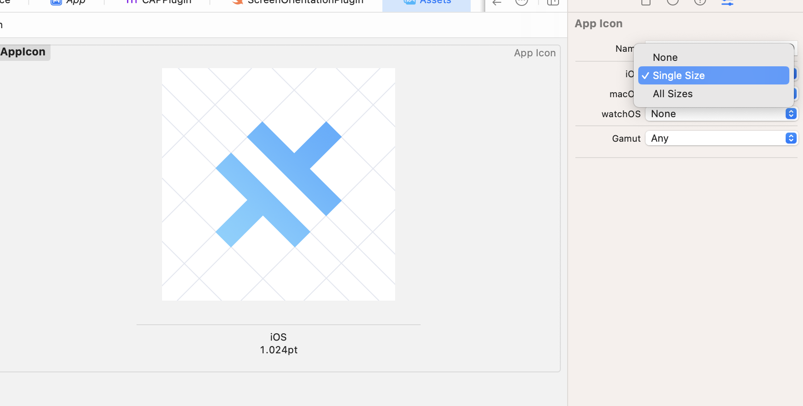

# Capacitor 4から、 Capacitor 5へのアップデートを行う。

以前のアップグレードに比べ、Capacitor 4と5の間のブレークチェンジは極めて少ないです。このガイドでは、プロジェクトを現在のCapacitor 5のバージョンにアップデートする手順と、公式プラグインのブレークチェンジのリストをご紹介しています。

## NodeJS 16+

Node 12はサポート終了しました。Node 14は2023年4月30日にサポート終了を迎えます。Capacitor 5は、NodeJS 16以上が必要です。(最新のLTSバージョンを推奨します)。

## CLIを使った移行方法

Capacitor CLI の `latest-5` バージョンをプロジェクトにインストールします：

```sh
npm i -D @capacitor/cli@latest-5
```

インストールしたら、以下を実行するだけで、CLIがマイグレーションを処理してくれます。

```sh
npx cap migrate
```

マイグレーションのステップのいずれかが完了できない場合は、ターミナルの出力で追加情報が利用できるようになります。手動でマイグレーションを行うための手順を以下に示します

## VS Code Extensionを使用したマイグレーション

VS Codeエクステンションがインストールされている場合、エクステンションのrecomendationsセクションをチェックして、プロジェクトをCapacitor 5に移行するオプションを見つけるだけです。

## iOS

以下のガイドは、Capacitor 4 iOSプロジェクトをCapacitor 5にアップグレードする方法について説明しています。

### Xcodeをアップグレードする

Capacitor 5はXcode 14.1+が必要です。

### .gitignoreを更新する

`.gitignore`ファイルを以下のように変更します：

```diff
- App/Podfile.lock
+ App/output 
```

### 1つのアプリアイコンを使用するようにアセットを更新する

Xcode 14は1024x1024の単一のアプリアイコンをサポートしているので、不要なサイズをすべて削除してAppIcon.appiconsetをきれいにすることができます。



## Android

以下のガイドでは、Capacitor 4のAndroidプロジェクトをCapacitor 5にアップグレードする方法について説明しています。

### Android Studioをアップグレードする

Capacitor 5では、Java JDK 17を必要とするGradle 8を使用するため、Android Studio Flamingo | 2022.2.1またはそれ以降が必要です。Java 17は、Android Studio Flamingoに同梱されています。追加のダウンロードは必要ありません！

Android Studioがアップデートされると、gradleに関連するいくつかのアップデートと、パッケージをビルドファイルに移動することを支援することができます。 まず、`Tools -> AGP Upgrade Assistant` を実行します。


### Androidプロジェクトの変数を更新

`variables.gradle`ファイルで、以下の新しいmin値に値を更新してください。

```groovy
minSdkVersion = 22
compileSdkVersion = 33
targetSdkVersion = 33
androidxActivityVersion = '1.7.0'
androidxAppCompatVersion = '1.6.1'
androidxCoordinatorLayoutVersion = '1.2.0'
androidxCoreVersion = '1.10.0'
androidxFragmentVersion = '1.5.6'
coreSplashScreenVersion = '1.0.0'
androidxWebkitVersion = '1.6.1'
junitVersion = '4.13.2'
androidxJunitVersion = '1.1.5'
androidxEspressoCoreVersion = '3.5.1'
cordovaAndroidVersion = '10.1.1'
```

### Google Servicesのアップデート

```diff
# build.gradle

    dependencies {
-       classpath 'com.google.gms:google-services:4.3.13'
+       classpath 'com.google.gms:google-services:4.3.15'

```

### gradle plugin を 8.0.0 にアップデート

```diff
# build.gradle

    dependencies {
-       classpath 'com.android.tools.build:gradle:7.2.1'
+       classpath 'com.android.tools.build:gradle:8.0.0'

```

### gradle wrapper を 8.0.2にアップデート

```diff
# gradle-wrapper.properties

distributionBase=GRADLE_USER_HOME
distributionPath=wrapper/dists
- distributionUrl=https\://services.gradle.org/distributions/gradle-7.4.2-all.zip
+ distributionUrl=https\://services.gradle.org/distributions/gradle-8.0.2-all.zip
zipStoreBase=GRADLE_USER_HOME
zipStorePath=wrapper/dists
```

### Jetifier を無効化

If you don't have any plugin that still uses old android support libraries instead of their equivalent AndroidX libraries remove this line.

```diff 
# gradle.properties

# Android operating system, and which are packaged with your app's APK
# https://developer.android.com/topic/libraries/support-library/androidx-rn
android.useAndroidX=true
- # Automatically convert third-party libraries to use AndroidX
- android.enableJetifier=true
```

### パッケージを `build.gradle` に移動

```diff
# AndroidManifest.xml

<?xml version="1.0" encoding="utf-8"?>
- <manifest xmlns:android="http://schemas.android.com/apk/res/android"
-     package="[YOUR_PACKAGE_ID]">
+ <manifest xmlns:android="http://schemas.android.com/apk/res/android">
```

```diff
# build.gradle

android {
+     namespace "[YOUR_PACKAGE_ID]"
      compileSdkVersion rootProject.ext.compileSdkVersion
```

### androidScheme のアップデート

Capacitor 6 では、Capacitor アプリケーションがシステムの [オートフィル機能](https://capacitorjs.com/docs/guides/autofill-credentials) を利用できるようにするため、__既存のアプリケーションの__  `androidScheme` のデフォルト設定を `https` とする予定です。

スキームを変更することは、アプリケーションを別のドメインで出荷することと同じであり、Cookieやlocalstorageなどに保存されたデータにはアクセスできなくなります。この変更によるデータ損失を避けるため、[Capacitor設定ファイル](https://capacitorjs.com/docs/config)では、スキームを現在のデフォルトであっても`http`に設定してください。

```typescript
{
  server: {
    androidScheme: "http"
  }
}
```

### kotlin バージョンのアップデート

kotlin を使用している場合は、`kotlin_version` 変数を `'1.8.20'` に更新してください。


## プラグイン

以下のプラグインの機能が変更または削除されました。それに合わせてコードを更新してください。

### Action Sheet

- `androidxMaterialVersion` variable has been updated to `1.8.0`.

### Browser

- `androidxBrowserVersion` variable has been updated to `1.5.0`.

### Camera

- Android 13 requiries to declare read media images permission (`<uses-permission android:name="android.permission.READ_MEDIA_IMAGES"/>`) in `AndroidManifest.xml`.
- `androidxMaterialVersion` variable has been updated to `1.8.0`.
- `androidxExifInterfaceVersion` variable has been updated to `1.3.6`.

### Device

- `DeviceId.uuid` changed to `DeviceId.identifier`
- On iOS 16+, `DeviceInfo.name` will return a generic device name unless you add the appropriate [entitlements](https://developer.apple.com/documentation/bundleresources/entitlements/com_apple_developer_device-information_user-assigned-device-name).

### Geolocation

- `playServicesLocationVersion` has been updated to `21.0.1`.

### Google Maps

- `googleMapsPlayServicesVersion` has been updated to `18.1.0`.
- `googleMapsUtilsVersion` has been updated to `3.4.0`.
- `googleMapsKtxVersion` has been updated to `3.4.0`.
- `googleMapsUtilsKtxVersion` has been updated to `3.4.0`.
- `kotlinxCoroutinesVersion` has been updated to `1.6.4`.
- `androidxCoreKTXVersion` has been updated to `1.10.0`.
- `kotlin_version` has been updated to `1.8.20`.

### Local Notifications

- Android 13 requires a new runtime permission check in order to schedule local notifications. You are required to call `checkPermissions()` and `requestPermissions()` accordingly, when targeting SDK 33.

### Push Notifications

- Android 13 requires a new runtime permission check in order to receive push notifications. You are required to call `checkPermissions()` and `requestPermissions()` accordingly, when targeting SDK 33.
- `firebaseMessagingVersion` variable has been updated to `23.1.2`.

### Status Bar

- On iOS, the default status bar animation has been changed to `FADE`.
