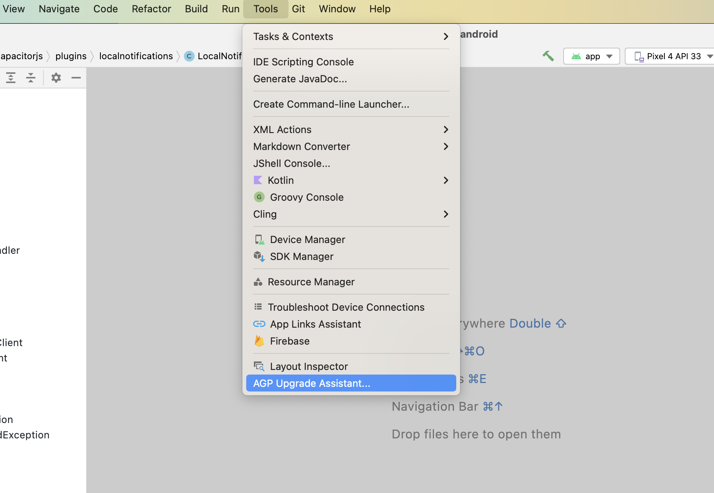

# Capacitor 7からCapacitor 8へのアップデート

このガイドでは、プロジェクトを現在のCapacitor 8バージョンにアップデートする手順と、公式プラグインの破壊的変更の一覧を紹介します。


## Capacitor設定ファイルの破壊的変更

`appendUserAgent`にはiOSでユーザーエージェントを追加する前に2つの空白を追加するバグがありましたが、修正されました。ユーザーエージェントの変更を防ぎたい場合は、`ios.appendUserAgent`に余分な空白を追加してください。ルートの`appendUserAgent`には追加しないでください。Androidにも空白が追加されてしまいます。

<!---
TODO - waiting for system bars plugin as it might change some config values
-->

## @capacitor/cliの破壊的変更

Capacitor CLIはデフォルトでiOS SPMプロジェクトを作成するようになりました。
既存のアプリには影響しませんが、`ios`フォルダを削除して再度`npx cap add ios`を実行すると、SPMテンプレートを使用して作成されます。CocoaPodsテンプレートを使用したい場合は、代わりに`npx cap add ios --packagemanager CocoaPods`を実行してください。

## @capacitor/androidの破壊的変更

`bridge_layout_main.xml`ファイルは削除されました。アプリコードやプラグインコードでこれを参照していた場合は、代わりに`capacitor_bridge_layout_main.xml`を使用してください。

## @capacitor/iosの破壊的変更

Capacitorは`CAPBridgeViewController`の`viewDidAppear`と`viewWillTransition`の通知を発行するようになりました。これらのイベントを発行するために`CAPBridgeViewController`の拡張機能を使用している場合は、削除してください。

## NodeJS 22以上

Capacitor 8にはNodeJS 22以上が必要です。（最新のLTSバージョンを推奨します。）

## CLIを使用した移行

プロジェクトに`latest`バージョンのCapacitor CLIをインストールします：

```sh
npm i -D @capacitor/cli@latest
```

インストール後、以下を実行するだけでCLIが移行を処理します。

```sh
npx cap migrate
```

移行の手順が完了できない場合は、ターミナルの出力に追加情報が表示されます。手動で移行を行う手順は以下に記載されています。

## iOS

以下のガイドでは、Capacitor 7 iOSプロジェクトをCapacitor 8にアップグレードする方法を説明します。

### Xcodeのアップグレード

Capacitor 8にはXcode 26.0以上が必要です。

### iOSデプロイメントターゲットの引き上げ

Xcodeプロジェクトで以下を行います：プロジェクトエディター内で**Project**を選択し、**Build Settings**タブを開きます。**Deployment**セクションで、**iOS Deployment Target**を**iOS 15.0**に変更します。すべてのアプリ**Targets**に対して同じ手順を繰り返します。

次に、プロジェクトがCocoaPodsを使用している場合は、`ios/App/Podfile`を開いてiOSバージョンを15.0に更新します：

```ruby
platform :ios, '15.0'
```

## Android

以下のガイドでは、Capacitor 7 AndroidプロジェクトをCapacitor 8にアップグレードする方法を説明します。

### Android Studioのアップグレード

Capacitor 8にはAndroid Studio Otter | 2025.2.1以降が必要です。

更新後、Android Studioはgradleに関連する更新やパッケージをビルドファイルに移動する作業を支援できます。開始するには、`Tools -> AGP Upgrade Assistant`を実行します。



### Androidプロジェクト変数の更新

`variables.gradle`ファイルで、値を以下の新しい最小値に更新します

```groovy
minSdkVersion = 24
compileSdkVersion = 36
targetSdkVersion = 36
androidxActivityVersion = '1.11.0'
androidxAppCompatVersion = '1.7.1'
androidxCoordinatorLayoutVersion = '1.3.0'
androidxCoreVersion = '1.17.0'
androidxFragmentVersion = '1.8.9'
coreSplashScreenVersion = '1.2.0'
androidxWebkitVersion = '1.14.0'
junitVersion = '4.13.2'
androidxJunitVersion = '1.3.0'
androidxEspressoCoreVersion = '3.7.0'
cordovaAndroidVersion = '14.0.1'
```

### 非推奨のGradleプロパティ名構文の置き換え

Gradleはプロパティ名構文を非推奨とし、値の前に`=`を使用することを推奨しています。現時点では警告のみですが、将来的には動作しなくなります。

```diff
# app/build.gradle
android {
-    namespace "com.getcapacitor.myapp"
-    compileSdk rootProject.ext.compileSdkVersion
+    namespace = "com.getcapacitor.myapp"
+    compileSdk = rootProject.ext.compileSdkVersion
...
     defaultConfig {
...
         aaptOptions {
-            ignoreAssetsPattern '!.svn:!.git:!.ds_store:!*.scc:.*:!CVS:!thumbs.db:!picasa.ini:!*~'
+            ignoreAssetsPattern = '!.svn:!.git:!.ds_store:!*.scc:.*:!CVS:!thumbs.db:!picasa.ini:!*~' 

```


### google servicesプラグインの更新

```diff
# build.gradle

    dependencies {
        classpath 'com.android.tools.build:gradle:8.7.2'
-       classpath 'com.google.gms:google-services:4.4.2'
+       classpath 'com.google.gms:google-services:4.4.4'

```


### gradleプラグインを8.13.0に更新

```diff
# build.gradle

    dependencies {
-       classpath 'com.android.tools.build:gradle:8.7.2'
+       classpath 'com.android.tools.build:gradle:8.13.0'

```

### gradleラッパーを8.14.3に更新

```diff
# gradle-wrapper.properties

distributionBase=GRADLE_USER_HOME
distributionPath=wrapper/dists
- distributionUrl=https\://services.gradle.org/distributions/gradle-8.11.1-all.zip
+ distributionUrl=https\://services.gradle.org/distributions/gradle-8.14.3-all.zip
zipStoreBase=GRADLE_USER_HOME
zipStorePath=wrapper/dists
```

### kotlinバージョンの更新

プロジェクトでkotlinを使用している場合は、`kotlin_version`変数を`'2.2.20'`に更新してください。

### configChangesにdensityを追加

アプリのリサイズ時にwebViewが再読み込みされるのを防ぐため、`AndroidManifest.xml`のアプリ`activity`の`configChanges`に`density`を追加します。

```diff
- android:configChanges="orientation|keyboardHidden|keyboard|screenSize|locale|smallestScreenSize|screenLayout|uiMode|navigation"
+ android:configChanges="orientation|keyboardHidden|keyboard|screenSize|locale|smallestScreenSize|screenLayout|uiMode|navigation|density"
```

## プラグイン

プラグインはバージョン8.0.0に更新されました。最新バージョンを使用するように更新してください。

以下のプラグイン機能が変更または削除されました。それに応じてコードを更新してください。

### Action Sheet

- `androidxMaterialVersion`変数が`1.13.0`に更新されました。

### Barcode Scanner

`scanOrientation`オプションは、Android 16以降の大画面デバイス（タブレットなど）では効果がありません。アプリの`AndroidManifest.xml`の`<application>`または`<activity>`内に&lt;property android:name="android.window.PROPERTY_COMPAT_ALLOW_RESTRICTED_RESIZABILITY" android:value="true" /&gt;を追加することで、この動作をオプトアウトできます。ただし、このオプトアウトは一時的なものであり、Android 17では機能しなくなることに注意してください。Androidは大画面での特定の向きの設定を推奨していません。通常のAndroidスマートフォンはこの変更の影響を受けません。詳細については、https://developer.android.com/about/versions/16/behavior-changes-16#adaptive-layouts のAndroidドキュメントを確認してください。


### Browser

- `androidxBrowserVersion`変数が`1.9.0`に更新されました。

### Camera

- `androidxExifInterfaceVersion`変数が`1.4.1`に更新されました。
- `androidxMaterialVersion`変数が`1.13.0`に更新されました。

### Geolocation

- `kotlinxCoroutinesVersion`変数が`1.10.2`に更新されました。
- `timeout`プロパティは、以前のWebとAndroidの`getCurrentPosition`のみではなく、AndroidとiOSのすべてのリクエストに適用されるようになりました。これはプラグインのドキュメントに記載されている内容と一致しています。アプリで位置情報をリクエストする際にタイムアウトが発生し始めた場合は、より高い`timeout`値の使用を検討してください。Androidの`watchPosition`では、バージョン8.0.0で導入された`interval`パラメータを使用できます。

### Google Maps

- `googleMapsPlayServicesVersion`変数が`19.2.0`に更新されました。
- `googleMapsUtilsVersion`変数が`3.19.1`に更新されました。
- `googleMapsKtxVersion`変数が`5.2.1`に更新されました。
- `googleMapsUtilsKtxVersion`変数が`5.2.1`に更新されました。
- `kotlinxCoroutinesVersion`変数が`1.10.2`に更新されました。
- `androidxCoreKTXVersion`変数が`1.17.0`に更新されました。
- `kotlin_version`変数が`2.2.20`に更新されました。

### Push Notifications

- `firebaseMessagingVersion`変数が`25.0.1`に更新されました。

### Screen Orientation

`lock`メソッドは、Android 16以降の大画面デバイス（タブレットなど）では効果がありません。アプリの`AndroidManifest.xml`の`<application>`または`<activity>`内に&lt;property android:name="android.window.PROPERTY_COMPAT_ALLOW_RESTRICTED_RESIZABILITY" android:value="true" /&gt;を追加することで、この動作をオプトアウトできます。ただし、このオプトアウトは一時的なものであり、Android 17では機能しなくなることに注意してください。Androidは大画面での特定の向きの設定を推奨していません。通常のAndroidスマートフォンはこの変更の影響を受けません。詳細については、https://developer.android.com/about/versions/16/behavior-changes-16#adaptive-layouts のAndroidドキュメントを確認してください。

### Splash Screen

- `coreSplashScreenVersion`変数が`1.2.0`に更新されました。

### Status Bar

`.capacitorViewDidAppear`と`.capacitorViewWillTransition`イベントを発行していた`CAPNotifications.swift`と`CAPBridgeViewController.swift`が削除されました。
これらは`@capacitor/ios`からリッスンできます。
<!---
TODO - watting for Android related breaking changes to be documented on the plugin
-->
